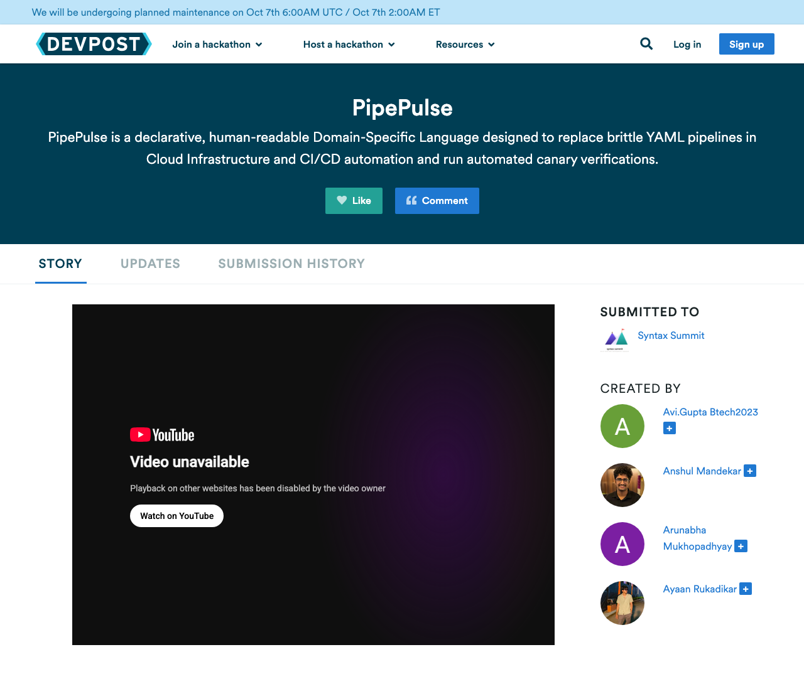

# Step 6 (Bonus): External DevOps challenge

**Group 34**

| Name | PRN |
|------|-----|
| Anshul Ravindra Mandekar | 23070122033 |
| Arunabha Mukhopadhyay | 23070122049 |
| Avi S Gupta | 23070122060 |
| Ayaan Rukadikar | 23070122063 |

## The challenge

- **Hackathon:** *Syntax Summit: Invent. Compile. Inspire.* on Devpost: <https://syntax-summit.devpost.com/>
- **Theme:** domain-specific languages (DSLs) for specialised fields, including automation
- **Format:** online and public, 292 participants on 5 October 2026
- **Deadline:** 14 January 2027. Judging happens after the deadline, so there is no result or
  leaderboard yet; the proof below is the proof of submission.

## Our entry: PipePulse

- **Project page:** <https://devpost.com/software/pipepulse>
- **What it is:** a declarative, human-readable DSL that replaces brittle YAML in CI/CD pipelines
  and cloud deployments, and runs automated canary checks.
- **Built with** (Devpost tags): Rust, Docker, Kubernetes, Monaco and CodeMirror
- **Status:** submitted to Syntax Summit on **4 October 2026** by all four of us

## How it relates to the Task 2 tools

| Task 2 step | Where PipePulse meets it |
|-------------|--------------------------|
| 1 · CI/CD pipeline | Pipeline, stage, artifact and environment are keywords of the language, not YAML keys, so a pipeline is checked before it runs: missing secrets, circular stage dependencies and invalid environment targets are compile errors. |
| 3 · Containers and Kubernetes | It targets container deployments, and rollback is a keyword, the same idea as the `kubectl rollout undo` we demonstrated. |
| 4 · Monitoring | Canary verification checks a new version's health before it takes all traffic, like our readiness probe and the Render health check. |

## Proof of submission

| Screenshot | Shows |
|------------|-------|
| [`devpost-project-page.png`](screenshots/devpost-project-page.png) | The public project page on 5 October 2026: *Submitted to Syntax Summit* and the four team members |
| [`devpost-team.png`](screenshots/devpost-team.png) | The project's story and team, seen from a team member's account |
| [`devpost-submission-history.png`](screenshots/devpost-submission-history.png) | The *Submission history* tab: PipePulse, submitted to Syntax Summit |

