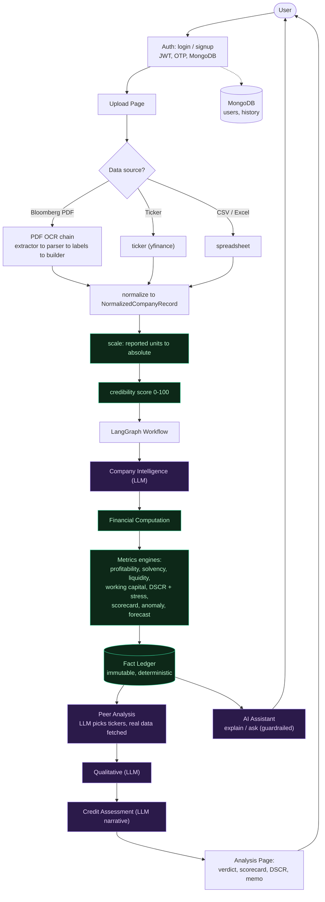

# FinVeritas — Architecture

**The one rule:** Python computes every number; the AI only narrates. Ratios, DSCR, the
credit grade and default-probability bands are all deterministic. The LLM classifies the
company, picks peer tickers (whose data is then *fetched*, not guessed), and turns the
computed facts into plain English. It can never invent or change a figure.

## System flow

**Green = deterministic (Python).  Purple = AI (explains only).**

## The Fact Ledger — the contract

The **Fact Ledger** is the boundary between the two layers. The metrics engines compute it
in pure Python; once built, its numbers are frozen. Every downstream consumer — the peer
comparison, the credit narrative, the AI assistant, the memo — can only *read* the ledger,
never recompute or alter a value. This is what makes the whole system auditable: every
figure has a formula and a source, and no LLM sits between the data and the number.

## Layers

| Layer | Package | Role |
|-------|---------|------|
| **Auth** | `finveritas/auth` | Login/signup, JWT sessions, OTP, MongoDB users |
| **Ingestion** | `finveritas/ingestion` (+ `pdf/`) | PDF/ticker/CSV → normalized record → unit-scale → credibility |
| **Deterministic** | `finveritas/analysis/metrics` | All numbers: profitability, solvency, liquidity, working-capital, DSCR + stress, scorecard, anomaly, forecast |
| **Agentic (AI)** | `finveritas/analysis/workflow`, `assistant` | Orchestration + narration + guardrailed Q&A — never computes |
| **Presentation** | `finveritas/analysis/page`, `finveritas/shared/components` | The results screens |
| **Shared** | `finveritas/shared` | Schema (the models), formatting, currency, meanings |

See **[STRUCTURE.md](STRUCTURE.md)** for the full file tree and execution order, and
**[VERSION_HISTORY.md](VERSION_HISTORY.md)** for how the system evolved (V1 → V2 → V3).
