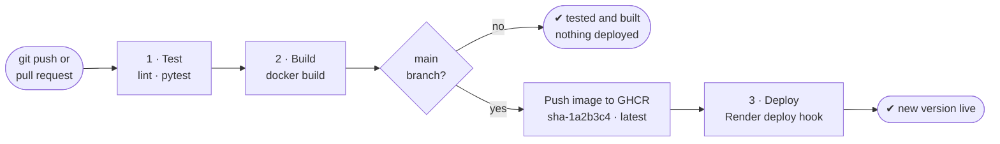

# CI/CD Pipeline

FinVeritas uses one **GitHub Actions** workflow,
[`.github/workflows/ci-cd.yml`](../.github/workflows/ci-cd.yml), with three jobs:
**Test → Build → Deploy**. Every push is tested and built. Every commit to `main` is also
published as a Docker image and deployed to **Render**.

| File | Role |
|------|------|
| [`.github/workflows/ci-cd.yml`](../.github/workflows/ci-cd.yml) | The pipeline |
| [`Dockerfile`](../Dockerfile) | How the app's Docker image is built |
| [`.dockerignore`](../.dockerignore) | Keeps `.env` (secrets) and tests out of the image |

---

## Pipeline diagram



If a job fails, the jobs after it don't run, so code that fails its tests is never deployed.

---

## The three jobs

| Job | Steps | Runs on |
|-----|-------|---------|
| **1 · Test** | Install dependencies → lint with `ruff` (syntax errors and undefined names only) → run the test suite with `pytest` (154 tests) | Every push and pull request |
| **2 · Build** | `docker build` the image, tagged `sha-<commit>` and `latest`. On `main`, log in to GitHub Container Registry (GHCR) and `docker push` it to `ghcr.io/rocko131205/pbl-2` | Every push and pull request (push to GHCR: `main` only) |
| **3 · Deploy** | Call Render's deploy hook. Render pulls the new `:latest` image and restarts the app | `main` only |

| Event | Test | Build | Push to GHCR | Deploy |
|-------|:---:|:---:|:---:|:---:|
| Push to any other branch, or a pull request | ✅ | ✅ | — | — |
| Push or merge to `main` | ✅ | ✅ | ✅ | ✅ |
| Manual run (*Actions → CI/CD → Run workflow*) | ✅ | ✅ | on `main` | on `main` |

The workflow logs in to GHCR with the built-in `GITHUB_TOKEN`, so the pipeline itself needs no
secrets. The only one is the Render deploy hook below.

---

## One-time setup to enable deploys

Until this is done, the **Deploy** job passes with a *"Not deployed"* warning. The rest of the
pipeline works as normal.

1. **Get a first image.** Push to `main`. When the run is green, the image is listed under
   *repo → Packages* (it is private, like the repo).
2. **Let Render pull it.** *GitHub → Settings → Developer settings → Personal access tokens
   (classic)*: create a token with only the `read:packages` scope.
3. **Create the Render service.** *New → Web Service → Existing image*:
   - Image URL `ghcr.io/rocko131205/pbl-2:latest`, with a registry credential (your GitHub
     username and the token from step 2).
   - Environment variables: the ones listed in [README.md](README.md#environment-variables-env-in-the-repo-root),
     at least `JWT_SECRET` and `MONGO_URI`.
   - *Health Check Path*: `/_stcore/health`.
   - Instance type *Free* is enough for a demo. Free instances sleep when idle, so the first
     visit after a while takes about a minute.
4. **Connect GitHub to Render.** Copy the service's *Settings → Deploy Hook* URL. In the GitHub
   repo, open *Settings → Secrets and variables → Actions → New repository secret* and add it
   as `RENDER_DEPLOY_HOOK_URL`.

From then on, every push to `main` is deployed automatically.

**Rollback:** in Render, open the service's *Events* and click *Rollback* on the last good
deploy. Or `git revert` the bad commit and push, and the pipeline deploys the fixed version.

---

## Running the same steps locally

```sh
pip install -r requirements.txt ruff
ruff check --select E9,F63,F7,F82 .                        # 1 · lint
pytest                                                     # 1 · test
docker build -t finveritas .                               # 2 · build
docker run --rm -p 8501:8501 --env-file .env finveritas    # run it: http://localhost:8501
```

If `MONGO_URI` points at a MongoDB on your machine, use `mongodb://host.docker.internal:27017`
inside the container.
