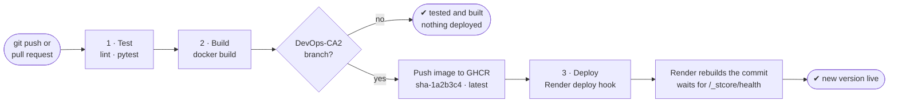

# CI/CD Pipeline

FinVeritas uses one **GitHub Actions** workflow,
[`.github/workflows/ci-cd.yml`](../.github/workflows/ci-cd.yml), with three jobs:
**Test → Build → Deploy**. Every push is tested and built. Every commit to `DevOps-CA2` that
passes both is deployed to **Render**, live at <https://finveritas.onrender.com>.

| File | Role |
|------|------|
| [`.github/workflows/ci-cd.yml`](../.github/workflows/ci-cd.yml) | The pipeline |
| [`Dockerfile`](../Dockerfile) | How the app's Docker image is built |
| [`.dockerignore`](../.dockerignore) | Keeps `.env` (secrets) and tests out of the image |

---

## Pipeline diagram



If a job fails, the jobs after it don't run, so code that fails its tests is never deployed.
Render's own Auto-Deploy is **off**: the pipeline's Deploy job is the only thing that deploys.

---

## The three jobs

| Job | Steps | Runs on |
|-----|-------|---------|
| **1 · Test** | Install dependencies → lint with `ruff` (syntax errors and undefined names only) → run the test suite with `pytest` (154 tests) | Every push and pull request |
| **2 · Build** | `docker build` the image, tagged `sha-<commit>` and `latest`. On `DevOps-CA2`, log in to GitHub Container Registry (GHCR) and `docker push` it to `ghcr.io/rocko131205/pbl-2` | Every push and pull request (push to GHCR: `DevOps-CA2` only) |
| **3 · Deploy** | Call Render's deploy hook. Render rebuilds the latest `DevOps-CA2` commit from the `Dockerfile` and switches traffic to it once `/_stcore/health` answers | `DevOps-CA2` only |

| Event | Test | Build | Push to GHCR | Deploy |
|-------|:---:|:---:|:---:|:---:|
| Push or merge to `DevOps-CA2` | ✅ | ✅ | ✅ | ✅ |
| Push to any other branch, or a pull request | ✅ | ✅ | — | — |
| Manual run (*Actions → CI/CD → Run workflow*) | ✅ | ✅ | on `DevOps-CA2` | on `DevOps-CA2` |

The workflow logs in to GHCR with the built-in `GITHUB_TOKEN`, so the pipeline itself needs no
secrets. The only one is the Render deploy hook below.

---

## One-time setup to enable deploys

Until this is done, the **Deploy** job passes with a *"Not deployed"* warning. The rest of the
pipeline works as normal.

1. **Let Render read the repo.** The repo is private, so install Render's GitHub app on your
   account (*github.com/apps/render → Configure*) and give it access to `PBL-2`.
2. **Create the Render service.** *New → Web Service*, pick `rocko131205/PBL-2`:
   - Language *Docker*, Branch `DevOps-CA2`. Render builds the repo's `Dockerfile` itself.
   - Environment variables: the ones listed in [README.md](README.md#environment-variables-env-in-the-repo-root),
     at least `JWT_SECRET` (random, so login tokens can't be forged), `MONGO_URI` (MongoDB Atlas,
     with *Network Access* allowing `0.0.0.0/0`: free Render services have no fixed IP) and
     `LLM_BASE_URL` / `LLM_MODEL` / `LLM_API_KEY`.
   - *Health Check Path*: `/_stcore/health`.
   - *Auto-Deploy*: **Off**. Otherwise Render deploys every push straight away, without
     waiting for the tests.
   - Instance type *Free* is enough for a demo. Free instances sleep when idle, so the first
     visit after a while takes about a minute.
   - Render sets `PORT=10000`; `finveritas/serve.py` starts Streamlit on it. The `/metrics`
     port (9464) is not exposed publicly.
3. **Connect GitHub to Render.** Copy the service's *Settings → Deploy Hook* URL. In the GitHub
   repo, open *Settings → Secrets and variables → Actions → New repository secret* and add it
   as `RENDER_DEPLOY_HOOK_URL`.

From then on, every push to `DevOps-CA2` that passes Test and Build is deployed automatically.
In Render's *Events*, these deploys show as triggered by the deploy hook.

**Rollback:** in Render, open the service's *Events* and click *Rollback* on the last good
deploy. Or `git revert` the bad commit and push, and the pipeline deploys the fixed version.

---

## Running the same steps locally

```sh
pip install -r requirements.txt ruff
ruff check --select E9,F63,F7,F82 .                        # 1 · lint
pytest                                                     # 1 · test
docker build -t finveritas .                               # 2 · build
docker run --rm -p 8501:8501 --env-file .env finveritas    # run it: http://localhost:8501
```

If `MONGO_URI` points at a MongoDB on your machine, use `mongodb://host.docker.internal:27017`
inside the container.
