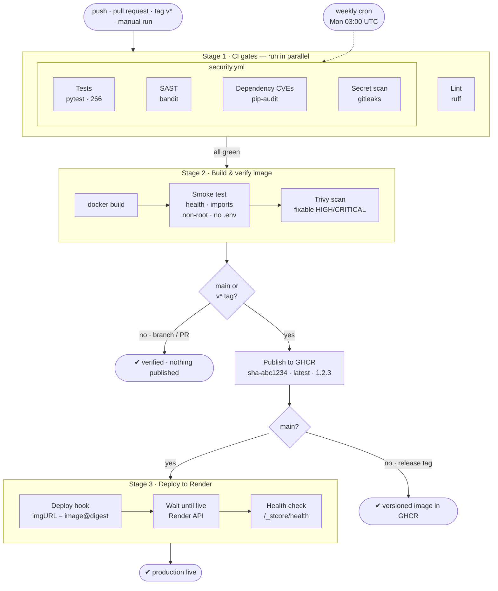

# CI/CD Pipeline

FinVeritas ships through **GitHub Actions**: every push is linted, tested and security-scanned;
every commit to `main` becomes a scanned Docker image in GitHub Container Registry and is
deployed to **Render** by its immutable digest, then health-checked.

| File | Role |
|------|------|
| [`.github/workflows/ci-cd.yml`](../.github/workflows/ci-cd.yml) | The pipeline: lint → gates → build → scan → publish → deploy → verify |
| [`.github/workflows/security.yml`](../.github/workflows/security.yml) | Security gates (tests, bandit, pip-audit, gitleaks) — called as Stage 1, and run weekly on its own |
| [`Dockerfile`](../Dockerfile) / [`.dockerignore`](../.dockerignore) | The production image (non-root, no secrets baked in) |
| [`.github/dependabot.yml`](../.github/dependabot.yml) | Weekly PRs to keep the pinned actions current |

---

## Pipeline diagram



Any red box stops the run — later stages never start, so nothing reaches production
unless every gate before it passed.

---

## What runs when

| Event | Stage 1 · gates | Stage 2 · build, smoke, Trivy | Push to GHCR | Stage 3 · deploy |
|-------|:---:|:---:|:---:|:---:|
| Push to a feature branch, or a pull request | ✅ | ✅ | — | — |
| Push / merge to `main` | ✅ | ✅ | `sha-…`, `latest` | ✅ |
| Tag `v1.2.3` | ✅ | ✅ | `sha-…`, `1.2.3`, `1.2` | — |
| Manual run (*Actions → ci-cd → Run workflow*) on `main` | ✅ | ✅ | ✅ | ✅ |
| Weekly cron | security gates only | — | — | — |

Runs on the same branch supersede each other, except on `main`, where a run is never
cancelled mid-deploy and deploys are queued one at a time.

---

## Stages

| Stage | Job | Fails the run when |
|-------|-----|--------------------|
| 1 | **Lint** — `ruff` (errors only: syntax, undefined names) | Code that can't run |
| 1 | **Tests** — 266 pytest tests incl. 113 security regression tests, Streamlit `AppTest` smoke tests | Any test fails |
| 1 | **SAST** — `bandit` | Medium+ severity, medium+ confidence finding |
| 1 | **Dependency CVEs** — `pip-audit` | A dependency has a known vulnerability |
| 1 | **Secret scan** — `gitleaks` over full history | A credential is committed |
| 2 | **Build** — Docker image, layer-cached across runs | Build error |
| 2 | **Smoke test** — boots the real container | `/_stcore/health` not `ok`, any module fails to import, runs as root, or `.env` is in the image |
| 2 | **Image scan** — Trivy over OS packages + Python libs | Any HIGH/CRITICAL CVE with a fix available |
| 2 | **Publish** — `docker push` to `ghcr.io/rocko131205/pbl-2` | — |
| 3 | **Deploy** — Render deploy hook with `imgURL=<image>@<digest>` | Render rejects the deploy |
| 3 | **Wait until live** — polls the Render API *(optional, needs `RENDER_API_KEY`)* | Deploy ends `build_failed` / `update_failed` / `canceled`, or isn't live in 10 min |
| 3 | **Health check** — `GET $APP_URL/_stcore/health` | Not `ok` within 5 min |

---

## Design decisions

- **Build once, deploy that exact artifact.** The image is built once, loaded locally, smoke-tested
  and scanned, then that same image is pushed; Render is told to run it **by digest**, not by a
  mutable tag. What ran in CI is byte-for-byte what runs in production.
- **Secrets never enter the image.** `JWT_SECRET`, `MONGO_URI`, API keys etc. are injected by
  Render at runtime. `.dockerignore` excludes `.env`, and the smoke test fails the build if one
  ever appears inside the image.
- **Least privilege.** The workflow token is read-only by default; only the build job gets
  `packages: write`. The container runs as an unprivileged user, and the app code is
  root-owned, so a compromised process can't modify it.
- **Third-party actions pinned by commit SHA.** Tags can be re-pointed — `aquasecurity/trivy-action`
  had its tags hijacked in March 2026. A SHA can't change underneath us; Dependabot proposes
  updates as PRs, which must pass this pipeline before merging.
- **Security gates are reused, not duplicated.** `ci-cd.yml` calls `security.yml`, so the same
  gates guard deploys *and* run weekly to catch newly published CVEs in unchanged code.

---

## One-time setup to enable deploys

Until step 4 is done, the pipeline still runs end to end: it publishes the image and the deploy
job **passes with a "Deploy skipped" warning** that shows the image reference ready to deploy.

1. **Get a first image.** Push to `main` (or click *Run workflow*). When the run is green, the
   image is at `ghcr.io/rocko131205/pbl-2` (*repo → Packages*). It is private, like the repo.
2. **Create a GitHub token for Render to pull it.** *GitHub → Settings → Developer settings →
   Personal access tokens (classic)* with only the `read:packages` scope.
3. **Create the Render service.** *New → Web Service → Existing image*:
   - Image URL: `ghcr.io/rocko131205/pbl-2:latest`, and add a **registry credential**
     (GitHub Container Registry · your GitHub username · the token from step 2).
   - Environment variables: everything from `.env.example` — at minimum `JWT_SECRET`
     (random, ≥ 32 chars) and `MONGO_URI` (MongoDB Atlas).
   - *Settings → Health Check Path*: `/_stcore/health`.
   - Instance type: **Free** is enough for a demo (measured: ~50 MiB idle, ~170 MiB with an
     active session; the free tier has 512 MB). Free instances sleep when idle, so the first
     request after a while takes about a minute.
4. **Connect GitHub to Render.** In the GitHub repo: *Settings → Secrets and variables → Actions*:

   | Kind | Name | Value |
   |------|------|-------|
   | Secret | `RENDER_DEPLOY_HOOK_URL` | Render → service → *Settings → Deploy Hook* |
   | Secret *(optional)* | `RENDER_API_KEY` | Render → *Account settings → API Keys* — lets the pipeline wait until the new version is actually live |
   | Variable | `APP_URL` | e.g. `https://finveritas.onrender.com` — enables the post-deploy health check and links the run to the site |

   Use repository-level secrets and variables: GitHub Free doesn't offer environment-scoped
   secrets on private repositories. On Pro or Team, you can move them into the `production`
   environment instead and restrict it to `main`.
5. Push to `main`. The run's **Deploy to production** job shows the deployed digest and links
   to the live site.

### Rollback

Every run deploys its own digest, so rolling back means redeploying an older run:
*Actions → ci-cd →* the last good run *→ Deploy to production → Re-run job*. That job reuses
the digest its original build produced. Render's own *Rollback* button also works.

---

## Running the image locally

```sh
docker build -t finveritas .
docker run --rm -p 8501:8501 --env-file .env finveritas      # http://localhost:8501
```

If `MONGO_URI` points at a MongoDB on your machine, use `mongodb://host.docker.internal:27017`
inside the container. Hosts that inject `$PORT` (Render, Railway, Cloud Run) are supported
automatically.
