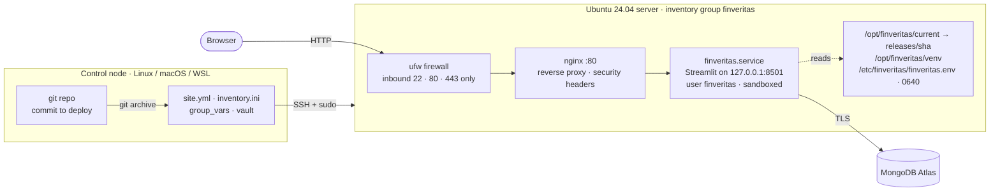

# Configuration Management (Ansible)

The CI/CD pipeline ([CI_CD.md](CI_CD.md)) ships FinVeritas to Render as a Docker image. This
playbook is the **self-hosted** option: it turns a fresh Ubuntu 24.04 server (any cloud VM or
lab machine) into a running FinVeritas host, using the same security model as the image —
an unprivileged service user, read-only app code, and secrets supplied only at runtime.

**Why Ansible over Puppet:** it's agentless. It needs nothing on the server except SSH and
Python, and nothing extra on the control node except `pip install ansible-core`. The whole
desired state is the YAML below.

| File | Role |
|------|------|
| [`deploy/ansible/site.yml`](../deploy/ansible/site.yml) | **The playbook** — packages, users, files, services, firewall, health check |
| [`deploy/ansible/inventory.ini`](../deploy/ansible/inventory.ini) | **The inventory** — which servers to configure, grouped `staging` / `production` |
| [`deploy/ansible/group_vars/finveritas/vars.yml`](../deploy/ansible/group_vars/finveritas/vars.yml) | Settings: package list, paths, ops users, app configuration |
| [`deploy/ansible/vault.example.yml`](../deploy/ansible/vault.example.yml) | Template for the encrypted secrets file (`vault.yml`, gitignored) |
| [`deploy/ansible/templates/`](../deploy/ansible/templates) | systemd unit, nginx site, runtime env file |
| [`deploy/ansible/requirements.yml`](../deploy/ansible/requirements.yml), [`ansible.cfg`](../deploy/ansible/ansible.cfg) | Collections used; Ansible settings |

---

## What the playbook builds



### 1 · Packages

| Package | Why |
|---------|-----|
| `python3`, `python3-venv` | Runtime; app dependencies go in an isolated virtualenv, never system-wide |
| `nginx` | Public entry point; Streamlit itself only listens on localhost |
| `ufw` | Host firewall |
| `unattended-upgrades` | Applies OS security patches daily (`/etc/apt/apt.conf.d/20auto-upgrades`) |
| `ca-certificates` | TLS to MongoDB Atlas and the LLM / data APIs |

### 2 · Users & groups

| Account | Type | Can do |
|---------|------|--------|
| `finveritas` | System user, no login shell, no password | Runs the app. Can't modify its own code, and can write only to `/var/lib/finveritas` and a private `/tmp` |
| `finveritas-ops` | Group | Read the app's logs (via `systemd-journal`), and `sudo systemctl restart finveritas` — nothing else |
| `finveritas_ops_users` | Human accounts from `vars.yml` | Members of `finveritas-ops`, SSH key login only; the key list is authoritative, so removed keys are revoked |

The sudo rule deliberately excludes `systemctl status` and `journalctl`: under sudo, their
pager is a root shell.

### 3 · Files & directories

| Path | Owner · mode | Contents |
|------|--------------|----------|
| `/opt/finveritas/releases/<sha>/` | `root:finveritas` · read-only to the app | One directory per deployed commit, built by `git archive`, so only tracked files ship (never `.env`) |
| `/opt/finveritas/current` | symlink | Points at the live release; switched atomically on deploy |
| `/opt/finveritas/venv/` | `root` | Python dependencies from that release's `requirements.txt` |
| `/etc/finveritas/finveritas.env` | `root:finveritas` · `0640` | `JWT_SECRET`, `MONGO_URI`, API keys — rendered from Ansible Vault, never logged |
| `/etc/systemd/system/finveritas.service` | `root` · `0644` | The service: runs as `finveritas`, restarts on failure, sandboxed (`ProtectSystem=strict`, `NoNewPrivileges`, no capabilities…) |
| `/etc/nginx/sites-available/finveritas.conf` | `root` · `0644` | Reverse proxy with WebSocket support, 25 MB upload cap, security headers; the default site is removed |
| `/etc/sudoers.d/finveritas-ops` | `root` · `0440` | The ops restart rule, checked with `visudo` before it's installed |
| `/etc/apt/apt.conf.d/20auto-upgrades` | `root` · `0644` | Turns on unattended security updates |

### 4 · Services, firewall, verification

`finveritas` and `nginx` are enabled at boot. ufw allows SSH first, then 80/443, and denies
everything else inbound. The last task fetches `http://127.0.0.1/_stcore/health` *through
nginx* and fails the run unless the app answers `ok`.

Config changes trigger handlers, so the app restarts only when its code, dependencies, unit
or secrets changed, and nginx reloads only after `nginx -t` passes.

---

## Running it

Ansible's control node must be Linux, macOS or **WSL** (not native Windows). The server
needs Ubuntu 24.04, SSH key access, and a user with sudo.

```sh
cd deploy/ansible
pip install ansible-core
ansible-galaxy collection install -r requirements.yml

# 1. Point the inventory at your server (inventory.ini → ansible_host=…)
# 2. Secrets: copy, fill in, encrypt
cp vault.example.yml group_vars/finveritas/vault.yml
ansible-vault encrypt group_vars/finveritas/vault.yml

# 3. Check connectivity, preview, then apply
ansible finveritas -m ping
ansible-playbook site.yml --ask-vault-pass --check --diff
ansible-playbook site.yml --ask-vault-pass
```

Then open `http://<server-ip>/`. For HTTPS, point a domain at the server, set
`finveritas_server_name`, and run `sudo certbot --nginx` on it.

> **WSL tip:** if the repo lives under `/mnt/c/…`, Ansible ignores `ansible.cfg` there because
> the directory looks world-writable. Run `export ANSIBLE_CONFIG=$PWD/ansible.cfg` first.

### Day-2 operations

| Task | Command |
|------|---------|
| Ship the latest commit | `ansible-playbook site.yml --ask-vault-pass --tags app` |
| Deploy a specific version | `… --tags app -e finveritas_version=v1.2.0` (any branch, tag or SHA) |
| Roll back | Re-run with `-e finveritas_version=<previous sha>`; the last 3 releases are kept on disk |
| Add / remove an ops user | Edit `finveritas_ops_users` in `vars.yml` (`state: absent` to remove), then `--tags users` |
| Rotate a secret | `ansible-vault edit group_vars/finveritas/vault.yml`, then `--tags app` (the app restarts) |
| Make someone an app admin | On the server: `sudo systemd-run --pipe --wait -p User=finveritas -p EnvironmentFile=/etc/finveritas/finveritas.env /opt/finveritas/venv/bin/python /opt/finveritas/current/scripts/make_admin.py user@example.com` |

---

## How it was verified

The playbook was run from a separate Ansible control container (ansible-core 2.21) over SSH
against a fresh **Ubuntu 24.04** container booting systemd, with only SSH and an `ubuntu` sudo
user — the same starting point as a new cloud VM.

| Check | Result |
|-------|--------|
| Fresh server → running app | Full run `failed=0`; the final health check through nginx returned `ok`, and the login page loads |
| Idempotency | Re-run on the configured server: **`changed=0`** |
| Network exposure | From another host: port 80 → app; port 8501 blocked. Streamlit listens on `127.0.0.1` only; ufw is `deny (incoming)` except 22/80/443 |
| Least privilege | App runs as `finveritas`; it can't modify its own code; the ops user can't read the secrets file |
| Secrets | A value containing `"`, `$`, `\` and `` ` `` reaches the app process byte-for-byte |
| What ships | The release holds exactly `app.py`, `finveritas/`, `.streamlit/`, `requirements.txt` and `scripts/`: no `.env`, no `__pycache__` |
| Ops user | SSH key login works and password login is refused; `sudo systemctl restart finveritas` is allowed, while `sudo systemctl status` and `sudo bash` are denied; logs are readable; `state: absent` removes the account and its home |
| Service sandbox | `systemd-analyze security`: **3.7 OK** (the stock nginx unit scores 9.6 UNSAFE) |
| Rollback | `--tags app -e finveritas_version=<older sha>`, then back to `HEAD`: the symlink switches each time and health stays `ok` |
| Lint | `ansible-lint --profile production`: 0 failures, 0 warnings |

Testing also caught one real bug, now fixed: Ansible's `pip` module needs `python3-packaging`,
which minimal Ubuntu images don't include.
