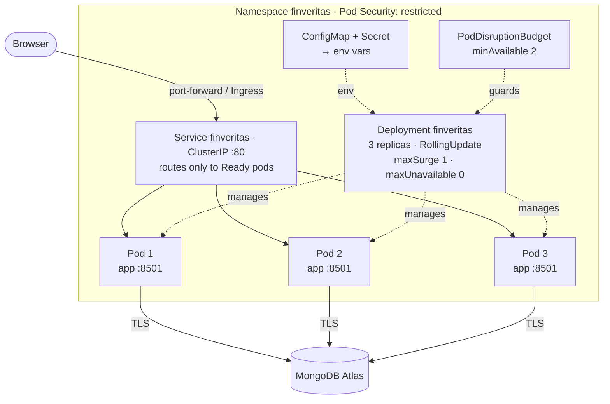
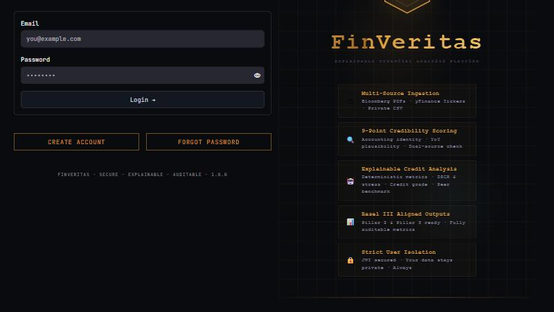
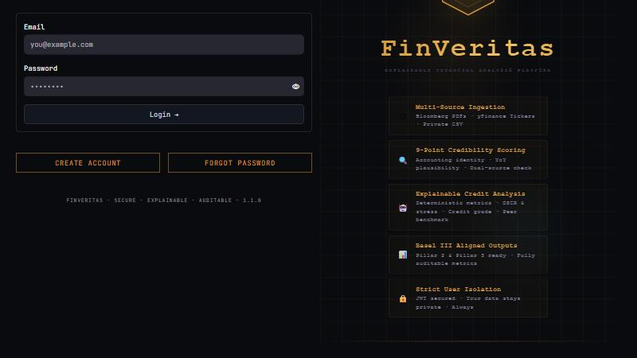

# Containers & Orchestration (Docker + Kubernetes)

FinVeritas runs as a container image ([`Dockerfile`](../Dockerfile)) and is orchestrated on
Kubernetes as a 3-replica **Deployment** behind a **Service**. Updates roll out one pod at a
time with zero downtime, and a bad release can be rolled back with one command. Both were
demonstrated on a real cluster, with an in-cluster client calling the app throughout:
**301 requests, 0 failed.**

| File | Role |
|------|------|
| [`Dockerfile`](../Dockerfile) | The image: `python:3.12-slim`, non-root `appuser` (uid 10001), patched OS packages, no secrets inside; `APP_VERSION` build-arg shown in the UI footer |
| [`deploy/k8s/base/deployment.yaml`](../deploy/k8s/base/deployment.yaml) | **Deployment** — 3 replicas, rolling-update strategy, health probes, resource limits, locked-down security context |
| [`deploy/k8s/base/service.yaml`](../deploy/k8s/base/service.yaml) | **Service** — stable address `finveritas:80` → pods on 8501, routes only to Ready pods |
| [`deploy/k8s/base/`](../deploy/k8s/base) `namespace` · `configmap` · `pdb` · `kustomization` | Namespace with Pod Security "restricted", non-secret settings, disruption budget, file list |
| [`deploy/k8s/overlays/local/`](../deploy/k8s/overlays/local) · [`production/`](../deploy/k8s/overlays/production) | Pick the image: locally built `finveritas:<ver>`, or `ghcr.io/rocko131205/pbl-2:sha-…` from CI |
| [`deploy/k8s/secret.example.yaml`](../deploy/k8s/secret.example.yaml) | Secret template — never applied from git |
| [`deploy/k8s/demo-rollout.sh`](../deploy/k8s/demo-rollout.sh) | The demonstration: deploy → rolling update → bad release → rollback, with live traffic |

---

## Architecture



### How a rolling update proceeds

With `maxSurge: 1` and `maxUnavailable: 0`, Kubernetes adds one new pod, waits until it is
Ready (and stays Ready for `minReadySeconds: 5`), and only then removes one old pod:

| Moment | v1.0.0 pods | v1.1.0 pods | Pods serving traffic |
|--------|:-----------:|:-----------:|:--------------------:|
| Before | 3 | – | 3 |
| New pod starting (surge) | 3 | 1 starting | 3 |
| New pod Ready → one old pod drained | 2 | 1 | 3 |
| Repeat ×2 | 0 | 3 | 3 |

Capacity never drops below 3. A new pod that never becomes Ready stops the rollout there, and
the old pods keep serving.

---

## The demonstration

`sh deploy/k8s/demo-rollout.sh` on a **kind** cluster (Kubernetes v1.37). The output below is real;
only repeated "Waiting…" lines are collapsed.

```text
==== 1. Deploy v1.0.0 (3 replicas) ====
deployment.apps/finveritas created
deployment "finveritas" successfully rolled out
POD                           IMAGE              READY   WAITING
finveritas-57cf94cff7-6gtbp   finveritas:1.0.0   true    <none>
finveritas-57cf94cff7-c9wn2   finveritas:1.0.0   true    <none>
finveritas-57cf94cff7-hs7cv   finveritas:1.0.0   true    <none>

==== 2. Start traffic: an in-cluster client calls the Service 5 times a second ====
pod/traffic created

==== 3. Rolling update: v1.0.0 -> v1.1.0 ====
deployment.apps/finveritas image updated
Waiting for deployment "finveritas" rollout to finish: 1 out of 3 new replicas have been updated...
Waiting for deployment "finveritas" rollout to finish: 2 out of 3 new replicas have been updated...
Waiting for deployment "finveritas" rollout to finish: 1 old replicas are pending termination...
deployment "finveritas" successfully rolled out
REPLICASET              IMAGE              DESIRED   READY
finveritas-57cf94cff7   finveritas:1.0.0   0         <none>
finveritas-678bd56bf8   finveritas:1.1.0   3         3

==== 4. Bad release: finveritas:1.2.0 was never built ====
deployment.apps/finveritas image updated
Waiting for deployment "finveritas" rollout to finish: 1 out of 3 new replicas have been updated...
error: timed out waiting for the condition
-> rollout is stuck: the new pod can't start, so the 3 v1.1.0 pods keep serving
POD                           IMAGE              READY   WAITING
finveritas-678bd56bf8-hfd5f   finveritas:1.1.0   true    <none>
finveritas-678bd56bf8-p7mph   finveritas:1.1.0   true    <none>
finveritas-678bd56bf8-sff9c   finveritas:1.1.0   true    <none>
finveritas-6b8d55b96c-zfddn   finveritas:1.2.0   false   ErrImagePull

==== 5. Roll back to the last good version ====
deployment.apps/finveritas rolled back
deployment "finveritas" successfully rolled out
REPLICASET              IMAGE              DESIRED   READY
finveritas-57cf94cff7   finveritas:1.0.0   0         <none>
finveritas-678bd56bf8   finveritas:1.1.0   3         3
finveritas-6b8d55b96c   finveritas:1.2.0   0         <none>
REVISION  CHANGE-CAUSE
1         initial deploy: finveritas:1.0.0
3         bad release: finveritas:1.2.0 (image missing)
4         rolling update to finveritas:1.1.0

==== 6. Traffic seen by the client during all of the above ====
t=  61s  requests=301  failed=0
no failed requests
```

What it shows:

- **Rolling update (step 3):** pods were replaced one at a time; the old ReplicaSet scaled to 0
  and the new one reached 3/3. The client saw no errors.
- **Safety net (step 4):** the broken release never received traffic. Its pod failed
  (`ErrImagePull`), so the rollout stopped and all 3 good pods stayed up.
- **Rollback (step 5):** `kubectl rollout undo` scaled the v1.1.0 ReplicaSet back up. Revision 2
  became revision 4: Kubernetes re-uses the old ReplicaSet and gives it the newest number.

The version is also visible in the app itself, through the Service:

| v1.0.0 | v1.1.0 |
|---|---|
|  |  |

(The footer under the sign-in buttons reads `FINVERITAS · SECURE · EXPLAINABLE · AUDITABLE · <version>`.)

---

## Running it yourself

Any local cluster works. On Windows the simplest is **Docker Desktop → Settings → Kubernetes →
Enable**, because it can use images you build with `docker build` directly.

```sh
# 1. Build two versions of the image
docker build --build-arg APP_VERSION=1.0.0 -t finveritas:1.0.0 .
docker build --build-arg APP_VERSION=1.1.0 -t finveritas:1.1.0 .
#    kind / minikube only — copy them into the cluster:
#    kind load docker-image finveritas:1.0.0 finveritas:1.1.0

# 2. Namespace and secrets (from your .env: plain KEY=value lines, no quotes)
kubectl apply -f deploy/k8s/base/namespace.yaml
kubectl -n finveritas create secret generic finveritas-secrets --from-env-file=.env

# 3. Run the demonstration
sh deploy/k8s/demo-rollout.sh

# 4. Open the app at http://localhost:8501
kubectl -n finveritas port-forward svc/finveritas 8501:80
```

`port-forward` attaches to a single pod, so restart it after a rollout replaces that pod.
Real traffic goes through the Service, which is why the demo's client runs *inside* the cluster.

### Day-to-day commands

| Task | Command |
|------|---------|
| Rolling update | `kubectl -n finveritas set image deployment/finveritas app=finveritas:1.1.0` |
| Watch it | `kubectl -n finveritas rollout status deployment/finveritas` |
| Revision history | `kubectl -n finveritas rollout history deployment/finveritas` |
| Roll back one version | `kubectl -n finveritas rollout undo deployment/finveritas` |
| Roll back to a specific revision | `kubectl -n finveritas rollout undo deployment/finveritas --to-revision=1` |
| Scale | `kubectl -n finveritas scale deployment/finveritas --replicas=5` |

`set image` and `rollout undo` change the cluster but not git, so a later `kubectl apply -k`
would put the image from the overlay back. That's what the warning printed by `rollout undo`
means. For anything long-lived, change `newTag` in the overlay and re-apply: that's a rolling
update too, and rolling back is reverting that commit. Keep `rollout undo` for emergencies, then
commit the matching tag.

### Production overlay

Uses the immutable `sha-<commit>` images that [the CI/CD pipeline](CI_CD.md) publishes to GHCR:

```sh
kubectl apply -f deploy/k8s/base/namespace.yaml
kubectl -n finveritas create secret docker-registry ghcr-pull --docker-server=ghcr.io \
  --docker-username=<github-user> --docker-password=<token with read:packages>
kubectl -n finveritas create secret generic finveritas-secrets --from-env-file=.env
kubectl apply -k deploy/k8s/overlays/production
```

To ship a new version, set `newTag` in `overlays/production/kustomization.yaml` to the new
`sha-…` tag and apply again.

---

## Design decisions

- **Zero-downtime updates:** `maxUnavailable: 0` + `maxSurge: 1`, a readiness probe on
  `/_stcore/health`, and `minReadySeconds: 5`, so a pod gets traffic only once it is proven
  healthy. A `preStop` sleep keeps a terminating pod serving for 5 s while the Service stops
  routing to it, so no in-flight request is dropped.
- **Failed releases stop themselves:** `progressDeadlineSeconds: 120` marks a stuck rollout as
  failed, and `revisionHistoryLimit: 5` keeps five versions to roll back to.
- **Three probes:** *startup* (up to 60 s to boot), *readiness* (gates traffic), *liveness*
  (restarts a hung container).
- **Sticky sessions:** Streamlit uploads a file over HTTP, then reads it from the user's
  WebSocket session. Both must reach the same pod, so the Service uses `sessionAffinity: ClientIP`.
- **Locked down:** the namespace enforces the *restricted* Pod Security Standard. Pods run as
  uid 10001 with a read-only root filesystem (only `/tmp` and `$HOME` are writable), all Linux
  capabilities dropped, no privilege escalation, and no Kubernetes API token.
- **Sized from measurements:** requests of 256 Mi / 100m CPU (the app uses ~50 Mi idle, ~170 Mi
  per session) and a 1 Gi memory limit. There's no CPU limit, which avoids throttling spikes.
- **Secrets stay out of git:** settings go in a ConfigMap, credentials in a Secret created from
  `.env`. `secret.example.yaml` documents the keys and is never applied by kustomize.
- **Available during maintenance:** the PodDisruptionBudget keeps at least 2 pods up while
  nodes are drained.

### Verified on the cluster

| Check | Result |
|-------|--------|
| Both overlays | Accepted by the API server (`kubectl apply --dry-run=server`), with no Pod Security warnings |
| Pods | 3/3 Ready, 0 restarts, uid 10001, writes to `/app` refused (read-only root), `/tmp` writable |
| Rolling update / bad release / rollback | As in the transcript above; 301 requests, **0 failed** |
| UI | Footer showed `1.0.0` and `1.1.0` through the Service, matching the live revision |
