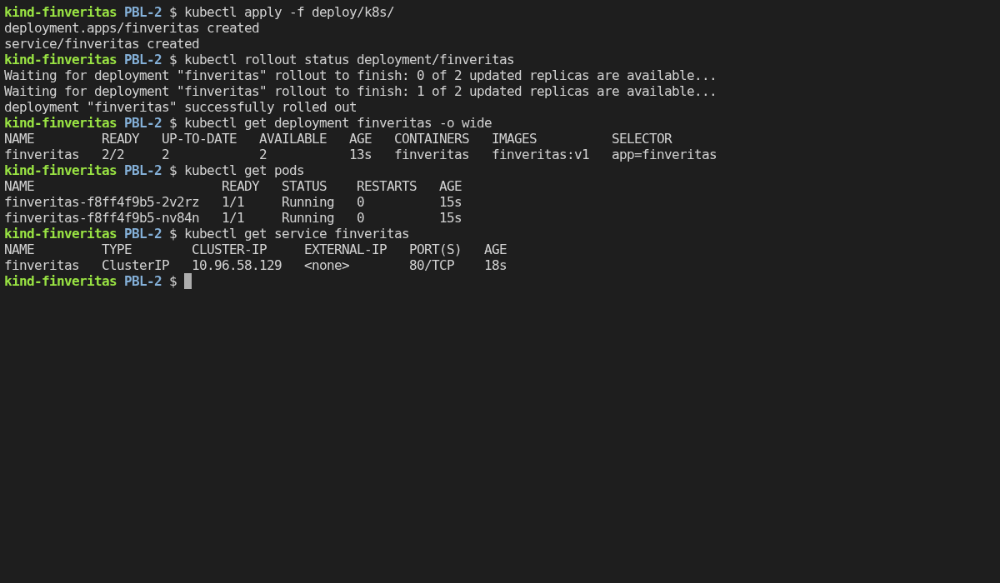
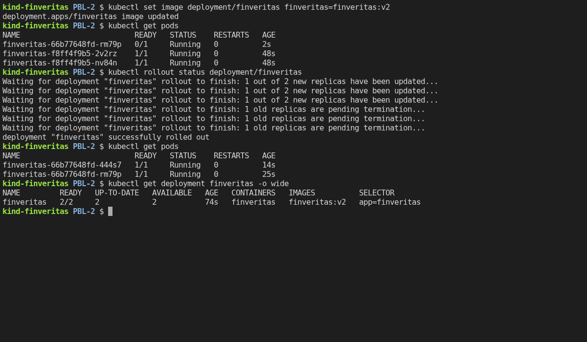

# Containers & Orchestration (Docker + Kubernetes)

FinVeritas is packaged as a Docker image and runs on Kubernetes as a **Deployment** of 2 pods
behind a **Service**. Changing the image starts a **rolling update** that replaces the pods
one at a time, and `kubectl rollout undo` **rolls back** to the previous version.

| File | What it does |
|------|--------------|
| [`Dockerfile`](../Dockerfile) | Builds the image: Python 3.12, the app's libraries, and Streamlit running as a normal user (`app`), not root |
| [`deploy/k8s/deployment.yaml`](../deploy/k8s/deployment.yaml) | **Deployment**: 2 pods, rolling update one pod at a time, a readiness check on `/_stcore/health`, and the `.env` secrets (optional) |
| [`deploy/k8s/service.yaml`](../deploy/k8s/service.yaml) | **Service**: one stable address, `finveritas:80`, that forwards to port 8501 on the pods that are ready |

---

## How the rolling update works

The Deployment uses `maxSurge: 1` (at most 1 extra pod) and `maxUnavailable: 0` (never fewer
ready pods than asked for). A new pod only counts once its readiness check passes, and the
Service only sends traffic to ready pods. So with 2 replicas, an update goes like this:

| Moment | v1 pods | v2 pods | Ready pods serving users |
|--------|:-------:|:-------:|:------------------------:|
| Before | 2 | – | 2 |
| An extra v2 pod starts | 2 | 1 starting | 2 |
| It's ready, so one v1 pod is stopped | 1 | 1 | 2 |
| A second v2 pod starts | 1 | 1 + 1 starting | 2 |
| It's ready, so the last v1 pod is stopped | – | 2 | 2 |

There are always 2 ready pods, so users see no downtime. If a new version never becomes
ready, the update stops there and the old pods keep running. A rollback is the same process
in reverse.

---

## The demonstration

Recorded on a local [kind](https://kind.sigs.k8s.io/) cluster (Kubernetes v1.37). Each
screenshot shows the real output of the commands typed into a terminal connected to it.

`finveritas:v2` is the same build as `v1` under a new tag. A new tag is all Kubernetes needs
to start an update, so it stands in for a new release. In real use, each release is a new
image from the CI pipeline, tagged `sha-<commit>`.

### 1 · Deploy v1: `kubectl apply` + `kubectl rollout status`



`apply` creates the Deployment and the Service. `rollout status` waits until both pods are
ready (0, then 1, then 2 available).

### 2 · Rolling update to v2: `kubectl set image` + `kubectl rollout status`



Straight after `set image`, one new pod (`66b77648fd`, `0/1`, still starting) runs next to
the two v1 pods (`f8ff4f9b5`). `rollout status` follows the update while the pods are swapped
one at a time. Afterwards both pods run `finveritas:v2`.

### 3 · Roll back: `kubectl rollout undo` + `kubectl rollout status`


`rollout undo` returns to the previous revision, replacing the pods one at a time again. The
image is `finveritas:v1` once more, and the pods have the v1 name (`f8ff4f9b5`) again, because
Kubernetes reuses the old ReplicaSet. In the history, revision 1 comes back as revision 3.

The warning is expected when a Deployment was created with `kubectl apply`. In day-to-day
use, you'd roll back by putting the old image back in `deployment.yaml` and applying it.

---

## Run it yourself

You need Docker Desktop, [kind](https://kind.sigs.k8s.io/) and `kubectl`. Run these from the
repo root:

```sh
kind create cluster --name finveritas
docker build -t finveritas:v1 .
docker tag finveritas:v1 finveritas:v2                                 # stands in for a new release
kind load docker-image finveritas:v1 finveritas:v2 --name finveritas   # copy the images into the cluster
kubectl create secret generic finveritas-env --from-env-file=.env      # optional: needed to log in

kubectl apply -f deploy/k8s/                                           # 1 · deploy v1
kubectl rollout status deployment/finveritas

kubectl set image deployment/finveritas finveritas=finveritas:v2       # 2 · rolling update
kubectl rollout status deployment/finveritas

kubectl rollout undo deployment/finveritas                             # 3 · roll back to v1
kubectl rollout status deployment/finveritas

kubectl port-forward service/finveritas 8080:80                        # open http://localhost:8080
kind delete cluster --name finveritas                                  # remove the cluster when done
```
