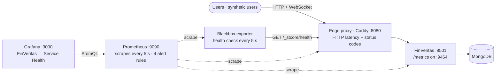
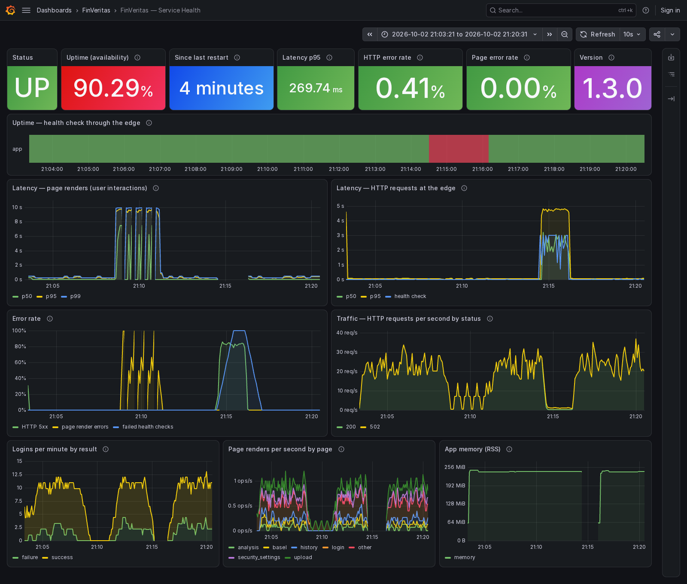
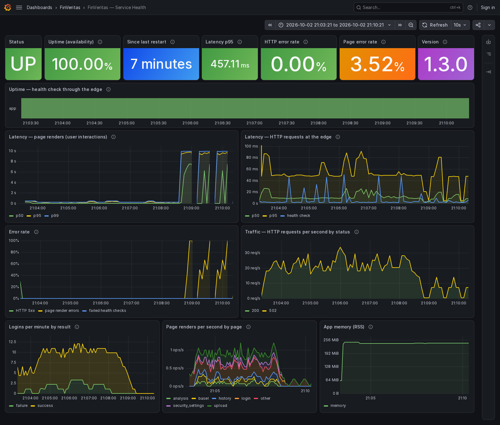
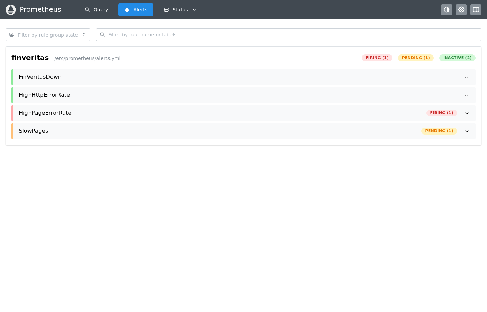
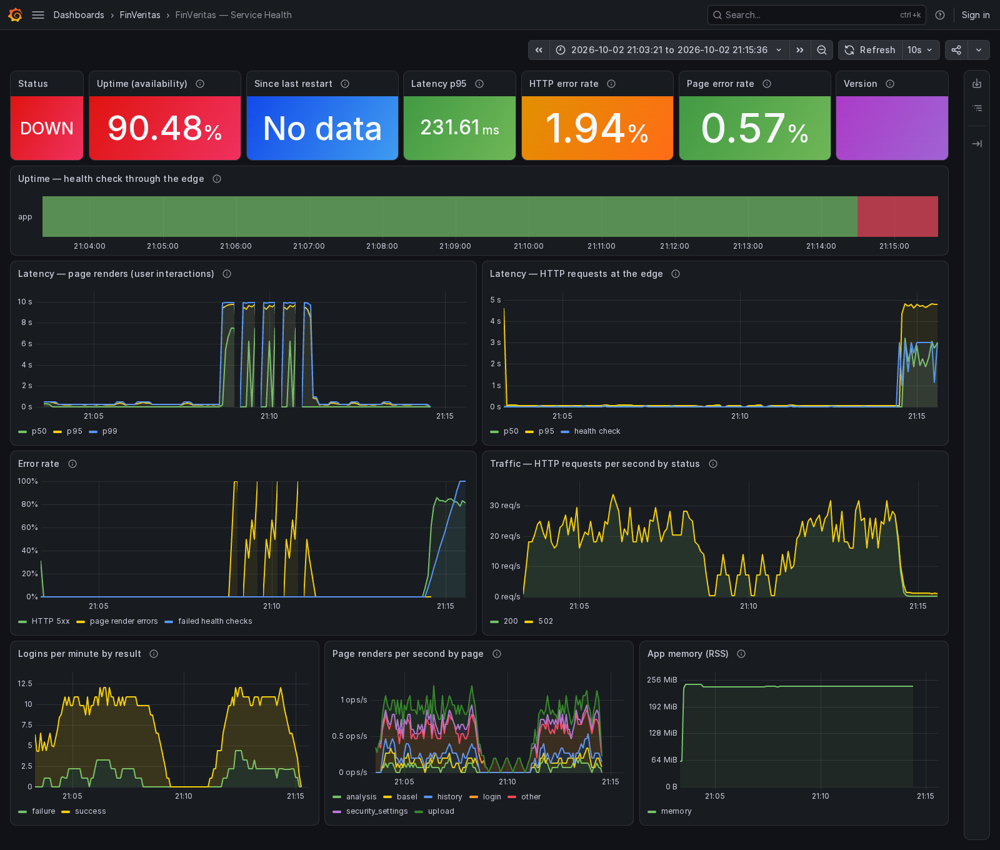
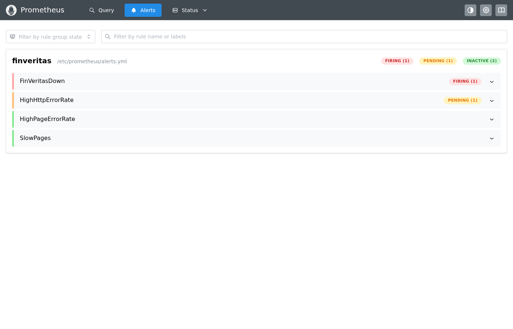
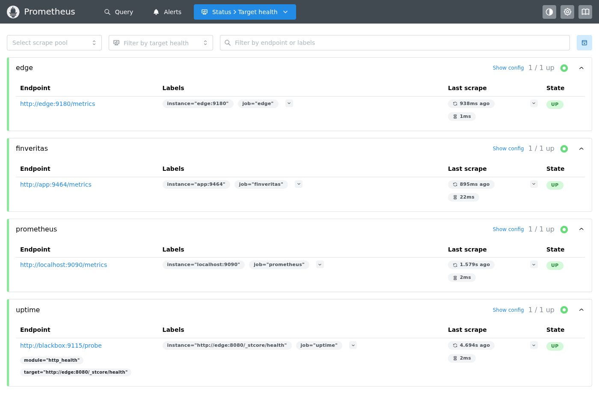

# Monitoring (Prometheus + Grafana)

FinVeritas exposes its own Prometheus metrics, and a Docker Compose stack runs **Prometheus**,
**Grafana**, a **blackbox exporter** and an edge proxy around it. A provisioned Grafana dashboard,
*FinVeritas — Service Health*, shows **uptime, latency and error rate**. The screenshots below
come from a real run with synthetic users and two staged incidents.

| File | Role |
|------|------|
| [`finveritas/shared/metrics.py`](../finveritas/shared/metrics.py) | The app's metrics: page-render latency and errors, logins, build version, process stats |
| [`finveritas/serve.py`](../finveritas/serve.py) | Container entry point: starts `/metrics` (port 9464) at boot, then Streamlit in the same process |
| [`deploy/monitoring/docker-compose.yml`](../deploy/monitoring/docker-compose.yml) | The stack: app + MongoDB, Caddy edge proxy, blackbox exporter, Prometheus, Grafana |
| [`deploy/monitoring/prometheus/`](../deploy/monitoring/prometheus) | Scrape config (4 targets, every 5 s) and 4 alert rules |
| [`deploy/monitoring/grafana/`](../deploy/monitoring/grafana) | Datasource + dashboard provisioning, and the dashboard JSON (15 panels) |
| [`deploy/monitoring/caddy/Caddyfile`](../deploy/monitoring/caddy/Caddyfile) · [`blackbox/blackbox.yml`](../deploy/monitoring/blackbox/blackbox.yml) | Edge proxy with request metrics; the uptime check |
| [`deploy/monitoring/synthetic/user.js`](../deploy/monitoring/synthetic/user.js) | Synthetic users: headless Chrome sessions that sign in and click through pages |

---

## Architecture



Three vantage points, because each catches failures the others miss:

| Vantage point | Source | Sees |
|---------------|--------|------|
| **Outside** (black-box) | Blackbox exporter → `probe_success`, `probe_duration_seconds` | Whether a user can reach the app at all: **uptime** |
| **Edge** | Caddy → `caddy_http_request_duration_seconds{code}` | Every HTTP request users make: **latency** and **5xx error rate**, including 502s when the app is down |
| **Inside** (white-box) | App → `finveritas_*` on `:9464` | Every user interaction (Streamlit re-runs the page script on each click): **render time**, **errors**, logins |

---

## What the dashboard shows

| Signal | Panels | Query (simplified) |
|--------|--------|--------------------|
| **Uptime** | *Status* (UP/DOWN), *Uptime (availability)* %, the up/down band, *Since last restart* | `avg_over_time(probe_success[range])`, `time() - process_start_time_seconds` |
| **Latency** | *Latency p95* stat; p50 / p95 / p99 of page renders and of HTTP requests | `histogram_quantile(0.95, sum by (le) (rate(finveritas_page_render_seconds_bucket[5m])))` |
| **Error rate** | *HTTP error rate*, *Page error rate*; error-rate graph (HTTP 5xx, page errors, failed health checks) | `rate(…{code=~"5.."}) / rate(…)`, `rate(finveritas_page_renders_total{outcome="error"}) / rate(…)` |
| Context | Traffic by status code, logins by result, renders per page, app memory, version | |

### Metrics the app exposes

| Metric | Type | Labels |
|--------|------|--------|
| `finveritas_page_render_seconds` | histogram | `page` |
| `finveritas_page_renders_total` | counter | `page`, `outcome` (`ok` / `error`) |
| `finveritas_logins_total` | counter | `result` (`success` / `failure` / `locked` / `mfa_required`) |
| `finveritas_build_info` | gauge | `version` |
| `process_*` | standard | CPU, memory, start time, open files |

Labels come from fixed lists only (`page` is one of 10 known screens, otherwise `other`), so
no emails or user data reach Prometheus. `st.stop()` and `st.rerun()` end a run on purpose and
are not counted as errors.

---

## Dashboard screenshots: one run, two incidents

A 17-minute recorded run (21:03–21:20 UTC). Two synthetic users signed in 171 times (visiting
3 pages each) and made 37 failed-login attempts with unknown emails; the edge carried 20–30
requests per second. Two incidents were staged along the way:

| Time (UTC) | What happened |
|------------|---------------|
| 21:03 | Steady traffic; page renders ~0.25 s p95, HTTP ~50 ms p95, no errors |
| 21:08 → 21:10:52 | **Database outage**: MongoDB stopped for 2½ minutes |
| 21:14:22 → 21:16:01 | **App outage**: the app container stopped for about 1½ minutes |
| 21:20 | Recovered; end of the run |

### 1 · The whole run



- **Uptime:** one red block, 21:14:30–21:16:05: the app outage. Availability over the run was
  **90.29%**. The database outage doesn't appear here, because the health endpoint doesn't need
  the database.
- **Latency:** page renders jump to ~10 s during the database outage (each waits out MongoDB's
  5-second timeout). HTTP latency at the edge climbs to ~5 s while the app is down.
- **Error rate:** page-render errors during the database outage; HTTP 5xx (~85%, the edge's 502s)
  and failed health checks (100%) during the app outage.
- **Context:** logins drop to zero in both incidents, traffic dips, and the memory line breaks
  where the app restarted ("Since last restart: 4 minutes").

### 2 · Mid database outage



The dashboard with its range ending at 21:10:21, two minutes into the outage. **Status UP, uptime
100%**, yet the graphs show what users actually got: 10-second page loads and failed sign-ins.
The 5-minute stats are already moving (page error rate 3.52%, latency p95 457 ms). This is why
the dashboard tracks latency and error rate, not just uptime.



Prometheus at that moment: **`HighPageErrorRate` firing**, `SlowPages` pending.

### 3 · Mid app outage



21:15:36: **Status DOWN**, the uptime band turns red, HTTP 5xx is ~85% (the edge answers 502),
and health checks fail 100%. "Since last restart" and the version show *No data*: the app
process is gone, so only the outside and edge views still report.



**`FinVeritasDown` firing**, `HighHttpErrorRate` pending.

### 4 · Prometheus scrape targets



All four targets are up: the app's `/metrics`, the edge, the uptime probe, and Prometheus itself.

---

## Alerts

Prometheus evaluates [`alerts.yml`](../deploy/monitoring/prometheus/alerts.yml) every 5 s
(see *Alerts* at http://localhost:9090/alerts):

| Alert | Fires when | Severity |
|-------|------------|----------|
| `FinVeritasDown` | The health check through the edge fails for 30 s | critical |
| `HighHttpErrorRate` | More than 5% of HTTP requests return 5xx for 1 min | warning |
| `HighPageErrorRate` | More than 5% of page renders raise an error for 1 min | warning |
| `SlowPages` | p95 page render time is above 2 s for 2 min | warning |

They're visible in Prometheus. Routing them to email or Slack would mean adding an
Alertmanager, a one-service addition to the stack.

---

## Running it

```sh
cd deploy/monitoring
cp .env.example .env                      # set JWT_SECRET, GRAFANA_ADMIN_PASSWORD, SYNTHETIC_PASSWORD
docker compose up -d --build              # app, MongoDB, edge, blackbox, Prometheus, Grafana
docker compose --profile load up -d       # optional: synthetic users (headless Chrome)
```

| URL | What |
|-----|------|
| http://localhost:8080 | The app, through the edge proxy |
| http://localhost:3000 | Grafana: opens on the dashboard, no login needed to view (admin password in `.env`) |
| http://localhost:9090 | Prometheus: targets, alerts, ad-hoc queries |

All ports are bound to `127.0.0.1`. `/metrics` on the app and edge is reachable only inside the
Compose network.

To recreate the incidents: `docker compose stop mongo` (database outage) or `docker compose stop app`
(app outage), then `start` again.

### On Kubernetes

The Deployment in [`deploy/k8s`](../deploy/k8s/base/deployment.yaml) exposes the same endpoint as a
named `metrics` port (9464), with `prometheus.io/scrape` / `prometheus.io/port` annotations for
Prometheus setups that discover pods that way. The Service doesn't expose it.

### Logging

The app logs to stdout (`docker compose logs app`, `kubectl logs`, or the systemd journal with the
Ansible setup). Security events also go to the `audit_log` collection, shown on the in-app
Security Dashboard. Shipping logs into Grafana (Loki) would be the natural next step.

---

## Design decisions

- **Metrics from boot, not first visit.** Streamlit only runs app code when someone connects, so
  `finveritas.serve` starts `/metrics` before Streamlit, in the same process, sharing one registry.
  CI's container smoke test checks the endpoint is up.
- **HTTP metrics at the edge.** Streamlit 1.64 runs on Starlette/Uvicorn and offers no supported
  hook for request metrics, so latency and status codes come from the proxy in front of it. That's
  the same place production traffic passes through (nginx in the Ansible setup, an Ingress on
  Kubernetes).
- **Page labels are set during the run.** After `st.stop()`, every Streamlit call raises again, so
  the app records which page it is rendering as it goes, and the timing wrapper never calls
  Streamlit. A regression test covers this.
- **Uptime is measured from outside.** The blackbox exporter goes through the edge exactly like a
  browser, so it catches a dead proxy or network as well as a dead app.
- **Safe defaults.** Metrics are off unless `METRICS_PORT` is set (local runs and tests unaffected).
  Secrets live only in the gitignored `.env`; Grafana is read-only for anonymous viewers.
