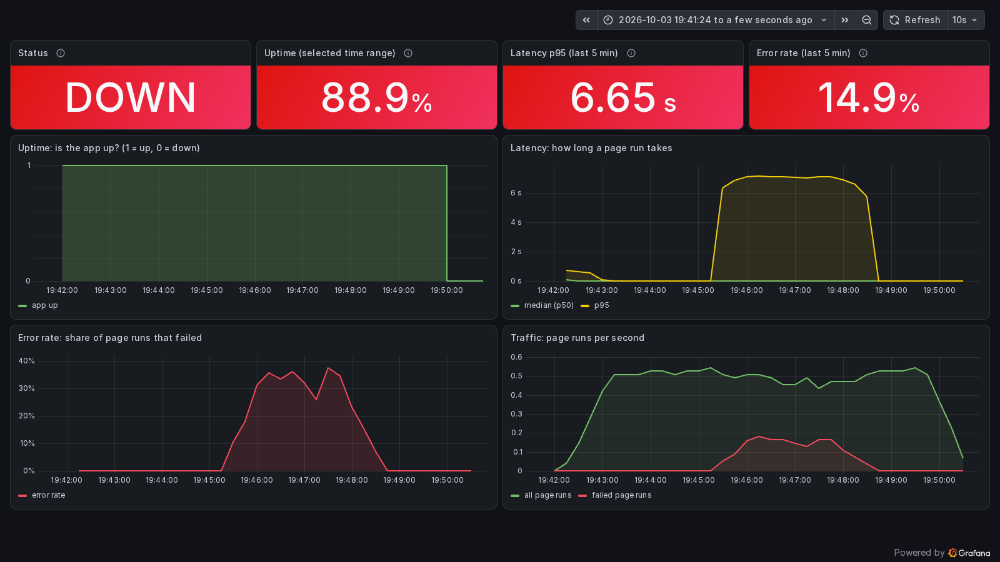
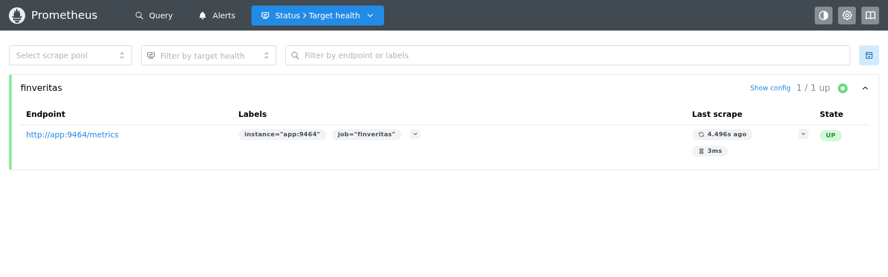

# Monitoring (Prometheus + Grafana)

The app exposes its own metrics at `/metrics`. **Prometheus** collects them every 5 seconds,
and a **Grafana** dashboard shows **uptime, latency and error rate**. One command starts the
app, Prometheus and Grafana together.

| File | What it does |
|------|--------------|
| [`finveritas/shared/metrics.py`](../finveritas/shared/metrics.py) | Defines the app's metrics, and `track_page_run()`, which counts and times every page run |
| [`app.py`](../app.py) (last lines) | Wraps each page run in `track_page_run()` |
| [`finveritas/serve.py`](../finveritas/serve.py) | The Docker entry point: starts `/metrics` on port 9464, then Streamlit, in one process |
| [`deploy/monitoring/docker-compose.yml`](../deploy/monitoring/docker-compose.yml) | Runs the app, Prometheus and Grafana |
| [`deploy/monitoring/prometheus.yml`](../deploy/monitoring/prometheus.yml) | Tells Prometheus to read `app:9464/metrics` every 5 seconds |
| [`deploy/monitoring/grafana/`](../deploy/monitoring/grafana) | Connects Grafana to Prometheus and loads the dashboard ([`finveritas.json`](../deploy/monitoring/grafana/finveritas.json)) |
| [`tests/test_metrics.py`](../tests/test_metrics.py) | Checks that runs are counted and that only real errors count as errors |

---

## How it works

```
 Browser ──▶ app :8501 (Streamlit)          Prometheus :9090           Grafana :3000
             │ every page run is counted    reads /metrics every 5 s   queries Prometheus,
             │ and timed (metrics.py)  ◀─── and stores the numbers ◀── draws the dashboard
             └ /metrics :9464 (serve.py)
```

A **page run** is Streamlit running `app.py` once. That happens on every page load and every
click, so it plays the role that a "request" plays in other web apps.

| Metric | Type | Meaning |
|--------|------|---------|
| `finveritas_page_runs_total` | Counter | Page runs so far |
| `finveritas_page_errors_total` | Counter | Page runs that failed with an error. `st.stop()` and `st.rerun()` are not errors |
| `finveritas_page_run_seconds` | Histogram | How long each page run took |
| `up` | Added by Prometheus | 1 if the last read of `/metrics` worked, 0 if the app was unreachable |

## The dashboard

| Panel | What it shows | Query (PromQL) |
|-------|---------------|----------------|
| **Status** | UP or DOWN right now | `up{job="finveritas"}` |
| **Uptime** | % of checks in the selected time range that found the app up | `avg_over_time(up{job="finveritas"}[$__range]) * 100` |
| **Latency** | Median and p95 page-run time | `histogram_quantile(0.95, sum by (le) (rate(finveritas_page_run_seconds_bucket[1m])))` |
| **Error rate** | Failed page runs ÷ all page runs | `sum(rate(finveritas_page_errors_total[1m])) / sum(rate(finveritas_page_runs_total[1m]))` |
| **Traffic** | Page runs per second, all and failed | `sum(rate(finveritas_page_runs_total[1m]))` |

p95 means 95% of page runs were faster than this. It shows the slow cases that an average hides.

---

## Screenshots

Recorded on the stack above. Two simulated visitors (headless Chrome) used the real app through
five phases, so every panel had something to show. The stack has no database, so login
attempts fail after the database's 5-second timeout: a real error, not a faked one. Times on
the screenshots are UTC.

| Phase (UTC) | What happened |
|-------------|---------------|
| 19:42 – 19:45 | Visitors open the login page |
| 19:45 – 19:47:40 | Half of the visits also try to log in, and each attempt fails |
| 19:47:40 – 19:49:50 | Visitors only open the login page again |
| 19:49:50 – 19:51:30 | The app container is stopped: an outage of 1 min 41 s |
| From 19:51:30 | The app is started again and visitors return |

### 1 · The whole run


- **Uptime:** the step down at 19:50 is the outage, so uptime for the period is **86.3%**.
- **Latency:** p95 sits around **9 ms** for normal page runs and rises to about **7 s**
  while logins time out. The small bumps after each start are the first page runs, while
  Python loads the app's modules.
- **Error rate:** reaches **37.5%** at its peak (1-minute window) and returns to **0%** once the
  logins stop. Over the run there were about **320 page runs**, and **25 failed**: one per login attempt.
- **Traffic:** the gap in the green line is the outage, when no page runs happened.

### 2 · During the outage



Taken about a minute into the outage. **Status** turned **DOWN** within one 5-second check,
and all four headline numbers turned red.

### 3 · Prometheus collecting the app's metrics



Prometheus's *Status › Target health* page: the `finveritas` job reads `http://app:9464/metrics`,
each read takes a few milliseconds, and the target is **UP**.

---

## Run it yourself

From the repo root (needs Docker Desktop):

```sh
docker compose -f deploy/monitoring/docker-compose.yml up -d --build
```

Then open the app at http://localhost:8501 and click around. The dashboard at
http://localhost:3000 fills in within a minute. Prometheus is at http://localhost:9090.
To stop everything:

```sh
docker compose -f deploy/monitoring/docker-compose.yml down
```

This stack has no database, so the app's pages work but logging in fails, which is how the
errors in the screenshots were produced. To monitor the full app, add your settings to the
`app` service in `docker-compose.yml`:

```yaml
    env_file: ../../.env
```
