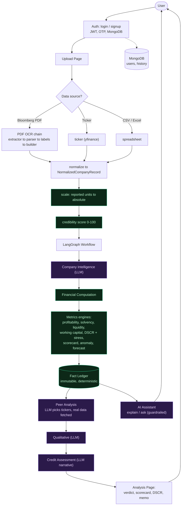

# FinVeritas — Explainable Credit-Risk Analysis

> **Financial truth, quantified.**
> A credit-underwriting assistant that ingests a company's financials and produces a
> defensible read on **can they repay, how risky, and on what terms** — with every
> number computed deterministically in Python and the LLM used only to *explain*, never
> to calculate.

---

## The one rule

**Python computes every number; the AI only narrates.** Ratios, DSCR, the credit grade,
default-probability bands — all deterministic. The LLM classifies the company, picks peer
tickers (whose data is then *fetched*, not guessed), and turns the computed facts into
plain English. It can never invent or change a figure.

---

## Architecture



**Green = deterministic (Python).  Purple = AI (explains only).** The **Fact Ledger** is
the contract between them: once the engines compute it, the numbers are frozen and the AI
can only read them.

For the full file tree and execution order, see **[STRUCTURE.md](STRUCTURE.md)**.
For how the system evolved (V1 → V2 → V3), see **[VERSION_HISTORY.md](VERSION_HISTORY.md)**.

---

## What it produces

- **Verdict banner** — one line: grade, risk, min DSCR, biggest watch item.
- **Credit scorecard** — an industry-aware grade (AA…D) + approximate default-probability
  band, with a transparent factor breakdown (repayment, leverage, liquidity, profitability,
  stability).
- **Debt serviceability** — real DSCR with a selectable cash basis (EBITDA / EBIT / OCF /
  **CFADS**), a full year-by-year amortization schedule, **minimum DSCR**, and **stress
  tests** (revenue haircuts, rate shocks).
- **Metrics** — profitability, solvency, liquidity, working-capital cycle (DSO/DIO/DPO/CCC),
  each with a plain-English "what this means".
- **Trends & forecast** — history plus a 3-year projection (base / optimistic / pessimistic).
- **Peer benchmarking** — real peer data fetched from yfinance (never LLM-estimated).
- **Anomaly alerts** — large swings, sign flips, balance-sheet-that-doesn't-tie, impossible values.
- **AI assistant** — "explain these results" + a scoped "ask about this company" chat,
  grounded strictly in the computed facts.
- **Credit Memo** — a one-page lender memo, downloadable and printable to PDF.

---

## Key features

| Area | Details |
|------|---------|
| **3 data sources** | Bloomberg PDF, Yahoo Finance ticker, private CSV/Excel |
| **Deterministic engine** | All metrics + grade + DSCR computed in Python; immutable Fact Ledger |
| **Industry-aware** | SaaS / financial / manufacturing / retail / general scoring profiles |
| **Currency-correct** | FX-normalizable; INR shows in lakh/crore, others in K/M/B/T; reported-unit rescaling |
| **Guardrailed AI** | Any OpenAI-compatible endpoint (Groq, LM Studio, Ollama, OpenAI); explains, never calculates |
| **Auth** | MongoDB users, bcrypt, JWT sessions, email OTP |
| **Tested** | 153 pytest tests |

---

## Setup

```sh
git clone https://github.com/rocko131205/PBL-2.git
cd PBL-2/mayankPbl/ocr
python3 -m venv .venv && source .venv/bin/activate     # Windows: .venv\Scripts\activate
pip install -r requirements.txt
streamlit run app.py                                    # open http://localhost:8501
```

### Environment variables (`.env` in `mayankPbl/ocr/`)

```env
# Security
JWT_SECRET=your_secret
MONGO_URI=mongodb+srv://...

# Email OTP
SMTP_SERVER=smtp.gmail.com
SMTP_PORT=587
SMTP_USER=you@gmail.com
SMTP_PASS=your_app_password

# LLM (any OpenAI-compatible endpoint)
LLM_BASE_URL=https://api.groq.com/openai/v1
LLM_MODEL=meta-llama/llama-4-scout-17b-16e-instruct
LLM_API_KEY=your_key

# Optional supplemental data
NEWSAPI_KEY=...
FMP_API_KEY=...
```

The app runs without the LLM — only the narrative/AI-assistant needs the endpoint; all
numbers work regardless.

---

## Data sources

- **Bloomberg PDF** — upload the income statement and/or balance sheet PDFs; the OCR chain
  extracts them. If the statement is reported "in millions/lakhs/crore", pick that unit on
  the Upload page so magnitudes are correct.
- **Ticker (Yahoo Finance)** — e.g. `INFY.NS`, `TCS.NS`, `AAPL`. Pulls income statement,
  balance sheet, and cash-flow statement automatically.
- **Private CSV/Excel** — columns: `period, revenue, total_assets, total_liabilities,
  current_assets, current_liabilities, equity`. A template is available in the app.

---

## CLI (headless PDF → JSON)

```sh
python3 -m finveritas.ingestion.pdf.cli                                   # input_pdfs/ → output/
python3 -m finveritas.ingestion.pdf.cli --input path/to/pdfs --output out
```

---

## Testing

```sh
pytest            # 153 tests
```

---

## Disclaimer

FinVeritas is **decision support for a qualified analyst** — not a loan approval, rejection,
or binding credit decision. It does not compute regulatory capital measures (Basel III LCR,
NSFR, Tier 1/2). All data is from public filings / Yahoo Finance for educational use.

Built as a Problem-Based Learning (PBL) academic project.
