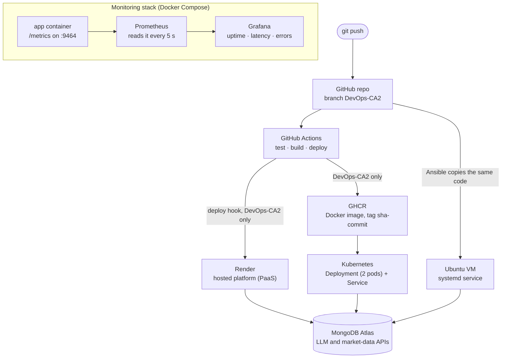
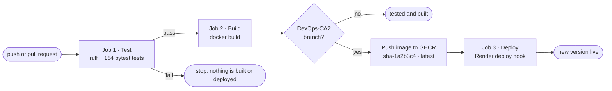
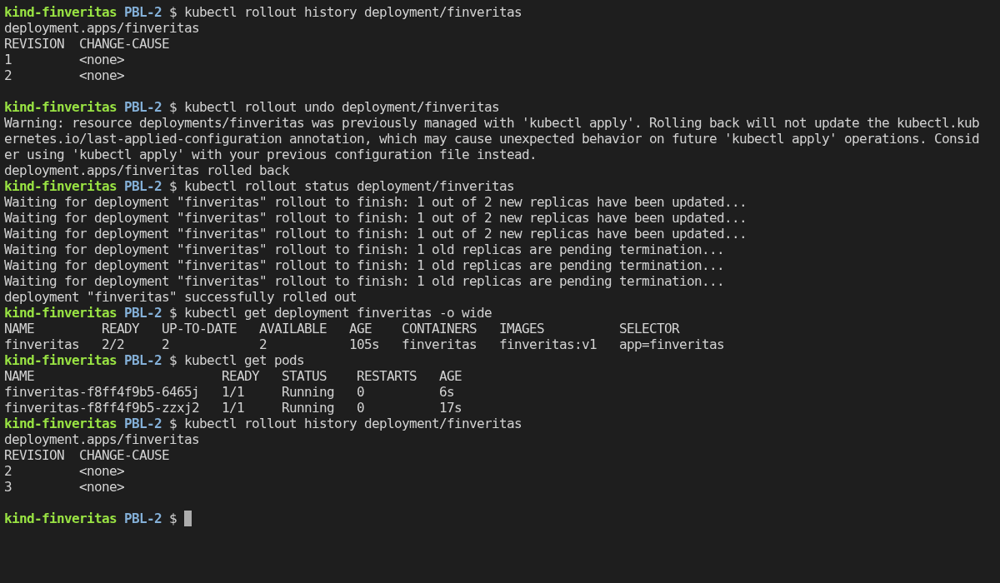
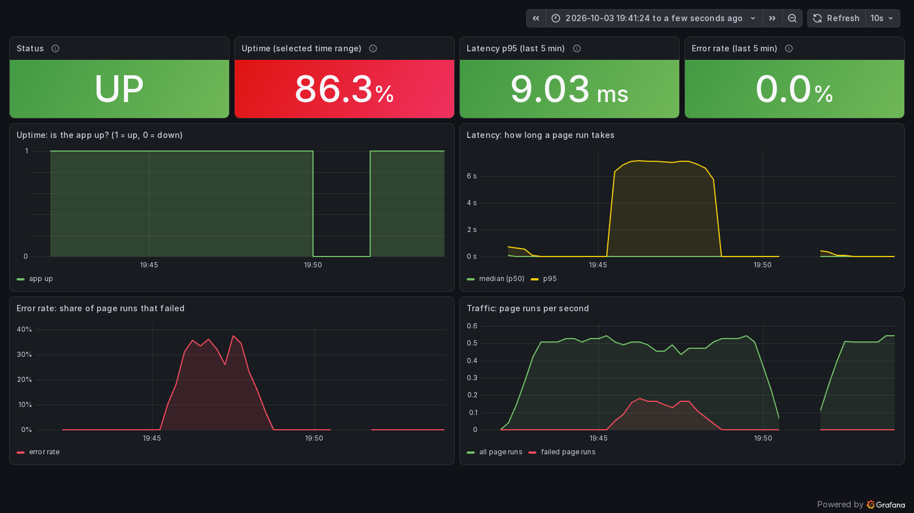

# DevOps CA2: Reflection and Report

FinVeritas is a Streamlit web app that analyses a company's financial statements for credit
risk. It reads PDFs, spreadsheets or a stock ticker, computes ratios, a scorecard and a
debt-service schedule, and writes an explainable credit memo. Users and their history are
stored in MongoDB.

For CA2 we took this app from "code in a repository" to a service that is **automatically
tested, built, deployed, orchestrated and monitored**. This report covers the **architecture**,
the **pipeline flow**, the **challenges** we met and the **lessons learned**. The 5-slide deck
follows the same structure, and each section here is the written version of one slide.

One rule guided every decision: **keep each piece simple enough to explain line by line.** It
is a college project, and an earlier, more "professional" pipeline taught us that complexity
we cannot explain is a liability (see [challenge 1](#41--a-pipeline-we-could-not-explain)).

All work is on the branch `DevOps-CA2` of `github.com/rocko131205/PBL-2`.

---

## 1 · What was delivered

| # | Task | What was built | Evidence | Documentation | Commit |
|---|------|----------------|----------|---------------|--------|
| 1 | Deployment (CI/CD) | GitHub Actions workflow with 3 jobs: test → build → deploy | Pipeline diagram | [CI_CD.md](CI_CD.md) | `2d63fd93` |
| 2 | Configuration management | Ansible playbook and inventory: packages, users, files | Run on a fresh Ubuntu 24.04 server: 8 changes, then 0 on a re-run | [site.yml](../deploy/ansible/site.yml) (header) | `76954e1c` |
| 3 | Containers and orchestration | Dockerfile, Kubernetes Deployment and Service | `kubectl rollout status` / `rollout undo` screenshots | [KUBERNETES.md](KUBERNETES.md) | `c2d5997c` |
| 4 | Monitoring | App metrics at `/metrics`, Prometheus, Grafana dashboard | Dashboard screenshots: normal traffic, an error spike, an outage | [MONITORING.md](MONITORING.md) | `442fbd35`, `b486bc64` |
| 5 | Reflection and report | 5-slide deck and this report | – | this file | this commit |

The test suite grew to **154 tests**, all passing, including a new one for the monitoring code.

---

## 2 · Architecture

**One codebase, three ways to run it, and one dashboard watching it.**



| Part | Technology | Its job |
|------|-----------|---------|
| The app | Streamlit, Python 3.12 | The web UI and all the analysis |
| Database | MongoDB Atlas | User accounts and saved file history |
| Outside services | An OpenAI-compatible LLM API; Yahoo Finance, NewsAPI, FMP | The written memo; market data |
| Source control | GitHub, branch `DevOps-CA2` | One place for the code, the pipeline and the infrastructure files |
| CI/CD | GitHub Actions ([`ci-cd.yml`](../.github/workflows/ci-cd.yml), 79 lines) | Tests every push, builds the image, deploys `DevOps-CA2` |
| Image registry | GitHub Container Registry (GHCR) | Stores each built image, tagged with its commit |
| Runtime 1 | Render | A hosted platform for the live app (<https://finveritas.onrender.com>), deployed by the pipeline |
| Runtime 2 | Kubernetes ([`deployment.yaml`](../deploy/k8s/deployment.yaml), [`service.yaml`](../deploy/k8s/service.yaml)) | 2 copies behind one address, with rolling updates and rollback |
| Runtime 3 | Ansible ([`site.yml`](../deploy/ansible/site.yml), [`inventory.ini`](../deploy/ansible/inventory.ini)) | Turns a plain Ubuntu server into one running the app |
| Monitoring | `prometheus_client` in the app, Prometheus, Grafana ([`deploy/monitoring/`](../deploy/monitoring)) | Uptime, latency and error rate on one dashboard |

**Why three runtimes?** Each answers a different question. Render is the simplest way to put
the app online. Kubernetes shows how a service scales and updates without downtime. Ansible
shows how to set up a server we fully control, without containers. They all run the **same
commit**, so a fix made once reaches all three.

**The container image** ([`Dockerfile`](../Dockerfile), 21 lines) is the common unit:

- Base image `python:3.12-slim`. The libraries are installed before the code is copied, so a
  code change does not reinstall them.
- The app runs as a normal user (`app`), not root. The code is owned by root, so the app cannot
  change it.
- [`finveritas/serve.py`](../finveritas/serve.py) is the entry point. It starts the `/metrics`
  endpoint on port 9464, then Streamlit on port 8501 (or `$PORT`), in one process.
- Secrets (`MONGO_URI`, `JWT_SECRET`, API keys) are never in the image. They are supplied at
  runtime: environment variables on Render, a Secret on Kubernetes, a `0600` file on the VM.

---

## 3 · Pipeline flow

### 3.1 From a commit to a running app



| Job | What it does | Runs on | Stops the pipeline when |
|-----|-------------|---------|-------------------------|
| **1 · Test** | Installs the dependencies, runs `ruff` for real errors (syntax errors, undefined names), then `pytest` | Every push and pull request | Any lint error or failing test |
| **2 · Build** | `docker build`, tagging the image `sha-<commit>` and `latest`. On `DevOps-CA2`, logs in to GHCR with the built-in `GITHUB_TOKEN` and pushes | Every push and pull request (push to GHCR: `DevOps-CA2` only) | The image does not build |
| **3 · Deploy** | Calls Render's deploy hook; Render rebuilds that commit from the `Dockerfile` and switches to it once `/_stcore/health` answers | `DevOps-CA2` only | The hook call fails |

| Event | Test | Build | Push to GHCR | Deploy |
|-------|:----:|:-----:|:------------:|:------:|
| Push to another branch, or a pull request | yes | yes | no | no |
| Push or merge to `DevOps-CA2` | yes | yes | yes | yes |

Each job starts only if the one before it passed, so **code that fails its tests is never
deployed**. The `sha-<commit>` tag ties every running image to the exact commit it came from.
The `RENDER_DEPLOY_HOOK_URL` repository secret connects the Deploy job to Render; without it,
the job passes with a "Not deployed" warning instead of failing ([CI_CD.md](CI_CD.md) has the
one-time setup). Render's own Auto-Deploy is off, so the pipeline is the only thing that deploys.

### 3.2 Shipping a new version on Kubernetes

The Deployment keeps **2 pods** running and replaces them one at a time (`maxSurge: 1`,
`maxUnavailable: 0`). A new pod only receives traffic once its **readiness probe** (Streamlit's
`/_stcore/health`) passes:

| Moment | Old (v1) pods | New (v2) pods | Ready pods serving users |
|--------|:-------------:|:-------------:|:------------------------:|
| Before | 2 | – | 2 |
| An extra v2 pod starts | 2 | 1 starting | 2 |
| It is ready, so one v1 pod stops | 1 | 1 | 2 |
| A second v2 pod starts | 1 | 1 + 1 starting | 2 |
| It is ready, so the last v1 pod stops | – | 2 | 2 |

`kubectl set image` starts an update, `kubectl rollout status` follows it, and
`kubectl rollout undo` returns to the previous version the same way. Kubernetes reuses the old
ReplicaSet, which is why the pods come back with their old names. All three steps are shown
with real screenshots in [KUBERNETES.md](KUBERNETES.md#the-demonstration).



*Figure 1: rolling back with `kubectl rollout undo` on a local kind cluster (real terminal output).*

### 3.3 Setting up a server with Ansible

```
inventory.ini (which server) + site.yml (what to do) ──SSH + sudo──▶ Ubuntu 24.04
   1. install Python and venv        2. create the "finveritas" service user
   3. copy the code (root-owned) and .env (0600)   4. install libraries into a virtualenv
   5. write a systemd service        6. start it now and at every boot
```

The playbook is **idempotent**: it describes the end state, so a second run changes nothing.
Tested against a fresh Ubuntu 24.04 container: the first run made 8 changes, the second made 0,
and editing only `.env` changed that one file and restarted the app.

### 3.4 Watching it run

```
every page run ─▶ counted and timed in the app ─▶ /metrics :9464 ─▶ Prometheus (every 5 s) ─▶ Grafana
```

| Question | Dashboard panel | Where the number comes from |
|----------|-----------------|-----------------------------|
| Is it up? How often was it up? | Status, Uptime % | Prometheus's own `up` metric: 1 if it could read `/metrics`, 0 if not |
| Is it fast? | Latency p50 / p95 | `finveritas_page_run_seconds`, a histogram of page-run times |
| Is it failing? | Error rate | `finveritas_page_errors_total` ÷ `finveritas_page_runs_total` |
| How busy is it? | Traffic | Page runs per second |

In the recorded demo the dashboard caught all three kinds of event:

- **Errors:** failing logins gave an error-rate peak of **37.5%** and p95 latency of about **7 s**,
  against **9 ms** normally.
- **Outage:** the app was stopped for **1 min 41 s**, and the status showed **DOWN** within one
  5-second check.
- **Totals:** uptime for the period was **86.3%**, with about **320 page runs**, of which **25 failed**.



*Figure 2: the Grafana dashboard after the demo run. All three screenshots are explained in
[MONITORING.md](MONITORING.md#screenshots).*

---

## 4 · Challenges and how we solved them

### 4.1 · A pipeline we could not explain

- **Problem:** our first pipeline (still on `main`) had **7 jobs across two workflow files
  (about 260 lines)**: a reusable security workflow, Trivy image scanning, actions pinned to
  commit hashes, Dependabot, and deploying by image digest. It worked, but we could not explain
  it line by line.
- **Fix:** rebuilt as **3 jobs in 79 lines**: test, build, deploy. The extras are listed as
  possible additions, not built.
- **Lesson:** complexity has a cost even when it works: every part has to be maintained,
  debugged and defended.

### 4.2 · Containers that took too long to stop

- **Problem:** during the rolling-update demo, old pods stayed in `Terminating` for about
  **30 seconds**, and `docker stop` took **11 seconds**.
- **Cause:** the image started the app with `sh -c "streamlit run …"`. The shell became the
  container's main process and did not pass the stop signal (`SIGTERM`) on to Streamlit, so
  Kubernetes and Docker waited out their grace periods and then killed it.
- **Fix:** first `exec`, so Streamlit replaced the shell. Since the monitoring task, the image
  runs `python -m finveritas.serve` directly, so Python is the main process. **Stop time: 11 s → 1 s.**
- **Lesson:** this bug did not show in any test. Running the real rollout exposed it.

### 4.3 · Keeping secrets out of git, images and logs

- **Problem:** `.env` holds the MongoDB URI, the JWT secret and API keys, and every runtime needs it.
- **Fix:**
  - `.env` is in `.gitignore` and `.dockerignore` (`**/.env`), so it is never committed or baked into an image.
  - Ansible copies it readable only by the app's user (`mode: "0600"`) and never prints it (`diff: false`).
  - Kubernetes loads it from a Secret (`envFrom`), marked optional so the app still starts without it.
  - The monitoring demo deliberately runs without it, and every port is bound to `127.0.0.1`.

### 4.4 · Running Ansible from Windows

- **Problem:** Ansible's control node must be Linux, macOS or WSL, and we develop on Windows.
- **Fix:** we tested the playbook with two containers: a fresh Ubuntu 24.04 "server" running
  SSH and systemd, and an Ansible "control" machine. That surfaced three more issues:
  - Ansible's `pip` module needs the `python3-packaging` package on the server, so the playbook installs it.
  - `ansible-lint` flagged the code copy for unset file permissions, so it now sets `mode: "0644"`
    (root-owned and read-only for the app).
  - Git Bash on Windows rewrote Linux paths such as `/repo` into Windows paths, which we
    turned off with `MSYS_NO_PATHCONV=1`.

### 4.5 · Zero-downtime updates on a local cluster

- **Problem:** a local kind cluster runs inside Docker and cannot see images built on the
  laptop. Without care, a new pod can receive traffic before the app has started.
- **Fix:**
  - `kind load docker-image` copies the images into the cluster.
  - A readiness probe, with `maxUnavailable: 0`, keeps 2 ready pods serving throughout.
- **Honest note:** `finveritas:v2` was the same build as `v1` under a new tag. That is enough
  for Kubernetes to perform a full rolling update and rollback; a real release would be a new
  image from CI.

### 4.6 · Monitoring an app that has no "requests"

- **Problem:** Streamlit has no per-request hooks; it re-runs `app.py` on every page load or
  click. Also, `st.stop()` and `st.rerun()` work by raising exceptions.
- **Fix:** we treat each **page run** as one request and wrap it in `track_page_run()`
  ([`metrics.py`](../finveritas/shared/metrics.py)).
  - **Not counted as errors:** we checked that Streamlit's stop and rerun exceptions are
    `BaseException`, not `Exception`, so `except Exception` lets them pass.
    [`test_metrics.py`](../tests/test_metrics.py) guards this.
  - **Up before the first visitor:** `/metrics` starts in `serve.py`, before Streamlit,
    because `app.py` only runs when someone visits. Prometheus can therefore see the app is up
    even with no visitors.
  - **Zero, not "No data":** the counters are created at 0 at startup, so the dashboard shows
    0 errors instead of "No data".

### 4.7 · Generating realistic traffic for the screenshots

- **Problem:** we drove the app with headless Chrome so the dashboard had real data. Two
  surprises:
  - Chrome refused plain HTTP to the host `app`, because `.app` is a real top-level domain that
    browsers only open over HTTPS.
  - Chrome ran out of shared memory: Docker gives a container 64 MB, so pages loaded blank.
- **Fix:** we addressed the app by its full container name and gave Chrome 1 GB. Failing logins
  (the demo stack has no database) gave a **real** error source rather than a faked one.

---

## 5 · Lessons learned

1. **Simple beats complete.** If we cannot explain a part, we do not need it yet. Start with
   the smallest thing that works, and add pieces when a real need appears. Every extra job,
   file or setting is something to maintain and defend.
2. **Automate the checks.** The linter and 154 tests run on every push, and a failed job stops
   the deploy. A mistake shows up in minutes, never in production. New code (the monitoring
   wrapper) came with its own test.
3. **Verify for real.** We ran every deliverable instead of trusting that it looked right:
   - the playbook against a fresh Ubuntu server;
   - Kubernetes on a real cluster;
   - the dashboard with real traffic, a real error spike and a real outage.

   The demos found the slow-stopping pods and several tooling problems that reading the code
   never would have.
4. **Describe the end state.** Ansible and Kubernetes are declarative: they say what should
   exist, not the steps to get there. That makes them safe to re-run (`changed=0`) and easy to
   review.
5. **Health checks drive everything.** One health page (`/_stcore/health`) and one metric (`up`)
   power the rollout safety, the Render health check and the uptime panel.
6. **Least privilege by default.** The container runs as a normal user, the server's service
   user cannot log in, the app cannot modify its own code, and secrets never touch git or an image.

**What we would do differently:** start from the simple version on day one, and run each
deliverable end to end as soon as it exists, not at the end.

---

## 6 · Limitations and next steps

| Limitation now | Next step |
|----------------|-----------|
| The free Render instance sleeps after 15 minutes without visitors, so the next visit takes about a minute | A paid instance, or open the site a minute before a demo |
| Render builds the commit itself, so the image in GHCR is not the exact image running there | Deploy the GHCR image by digest (an image-backed Render service) |
| The monitoring stack has no database, so logins fail there | Add `env_file: ../../.env` or a MongoDB service (see [MONITORING.md](MONITORING.md)) |
| No alerts: someone has to look at the dashboard | Prometheus alert rules, e.g. error rate above 5% for 5 minutes |
| No central logs | Ship container logs to Loki and show them in the same Grafana |
| The Ansible server starts Streamlit directly, so it has no `/metrics` | Start it with `python -m finveritas.serve`, like the image |
| HTTP only | HTTPS through an Ingress on Kubernetes, or a reverse proxy on the server |

---

## 7 · How to check the work

| What | Command or file |
|------|-----------------|
| Tests | `pytest`: 154 tests |
| CI/CD | [`.github/workflows/ci-cd.yml`](../.github/workflows/ci-cd.yml) and the **Actions** tab |
| Ansible | `ansible-playbook -i deploy/ansible/inventory.ini deploy/ansible/site.yml` (from Linux, macOS or WSL) |
| Kubernetes | The commands in [KUBERNETES.md](KUBERNETES.md#run-it-yourself) |
| Monitoring | `docker compose -f deploy/monitoring/docker-compose.yml up -d --build`, then http://localhost:3000 |
| Screenshots | [`docs/images/`](images): `k8s-1…3` (rollout) and `monitoring-1…3` (dashboard) |
