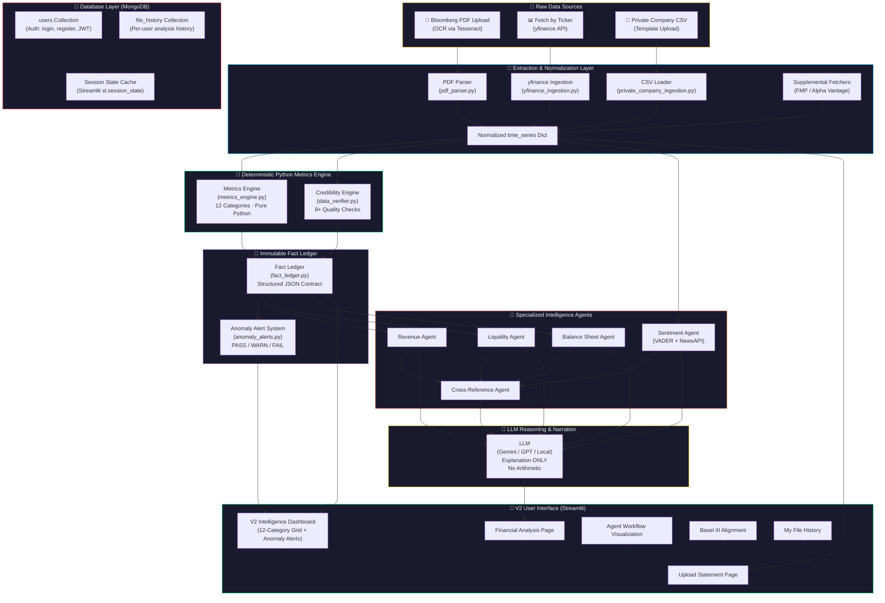
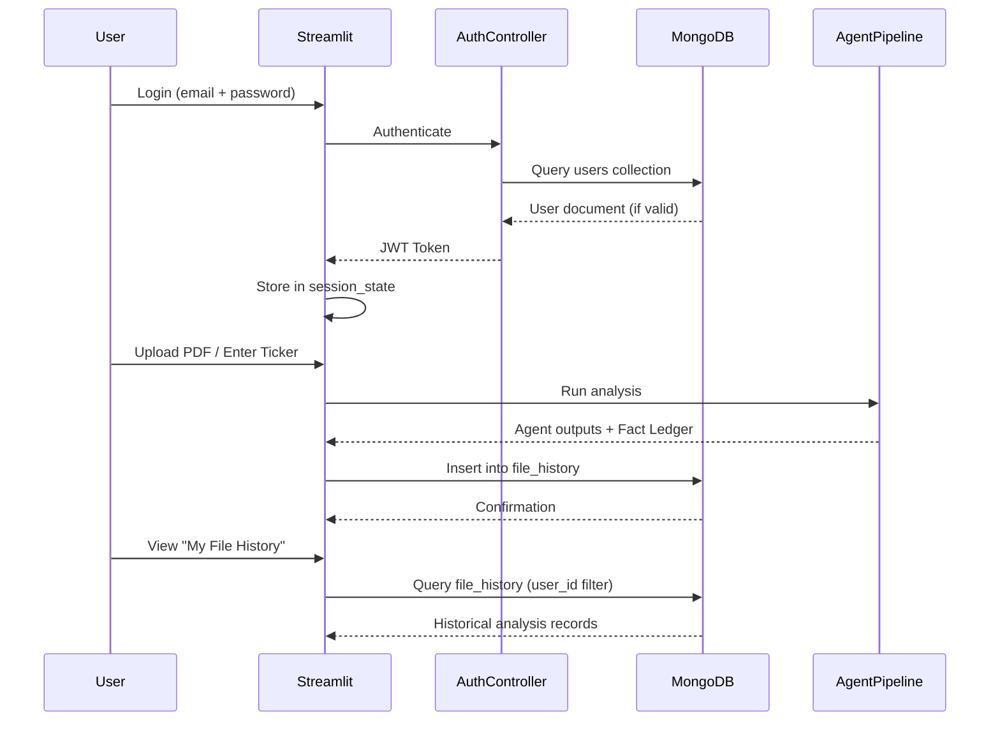
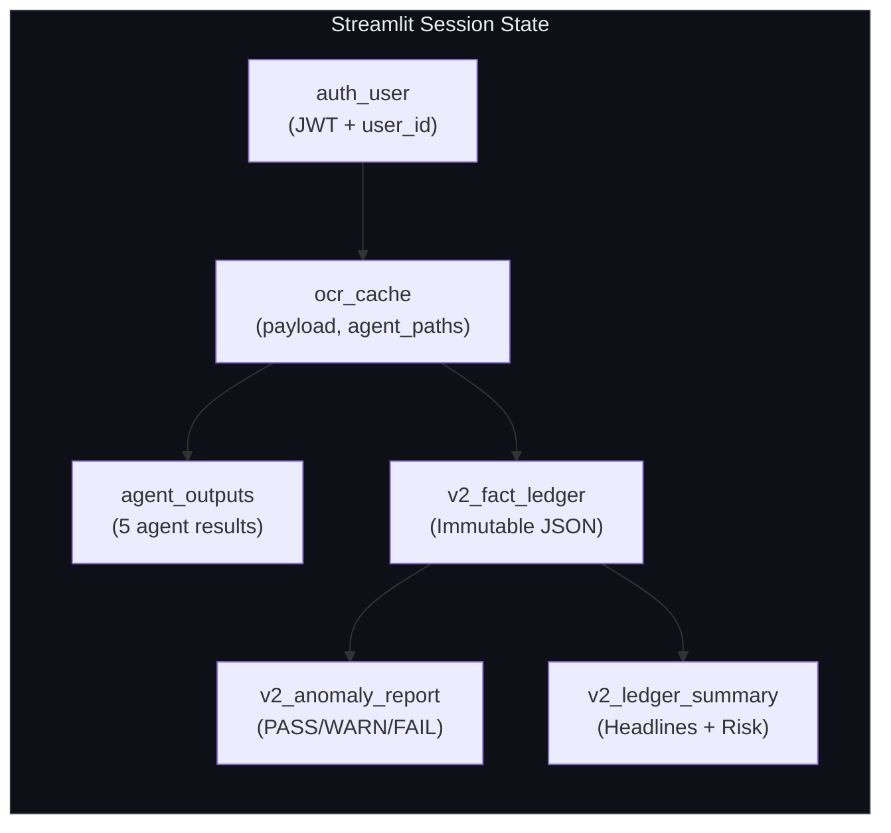

# FinVeritas V2 — System Architecture & Database Connectivity

## System Architecture Overview



## Database Connectivity

### MongoDB Atlas — Document Store

FinVeritas uses **MongoDB** as its primary database for:

| Collection | Purpose | Key Fields |
|---|---|---|
| `users` | Authentication (login, register, password reset) | `user_id`, `email`, `password_hash`, `jwt_token`, `created_at` |
| `file_history` | Per-user analysis history | `user_id`, `entity_name`, `source_type`, `credibility_score`, `fields_loaded`, `timestamp` |

### Connection Flow



### Session State Architecture



## Data Flow — The Immutable Pipeline

The fundamental architecture rule:

> **Python computes → Deterministic Fact Ledger → Specialized Agents → LLM narrates.**
> The LLM must never become the source of truth for financial arithmetic.

```
Input Sources → Extraction → Deterministic Engine → Immutable Ledger → Agents → LLM Narration → UI
     ↓              ↓               ↓                    ↓               ↓          ↓             ↓
  PDF/API/CSV    OCR/Parse     12 Categories          JSON Contract    5 Agents   Explanation   Dashboard
                               Pure Python             Immutable       Read-Only   Only          Rendering
```
